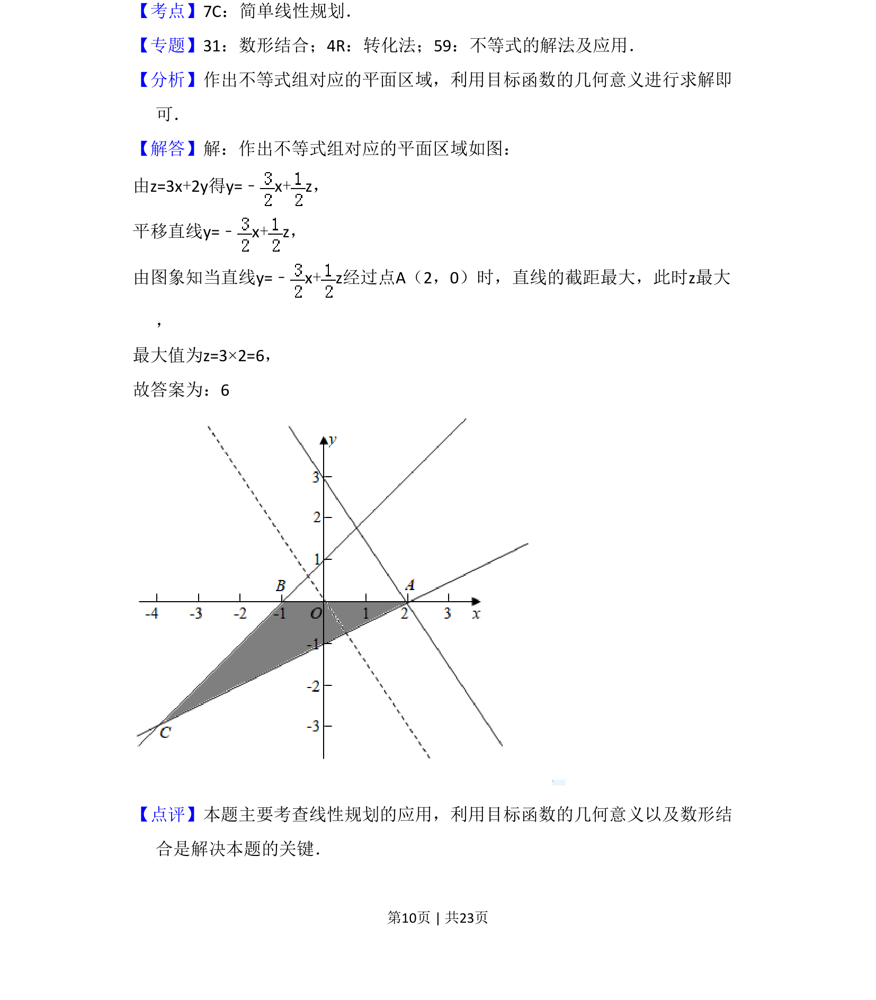

## 题面

## 摘要

通过线性规划求目标函数最大值，利用数形结合平移直线确定最优解。

## 关联考点

- [[1074-简单线性规划|简单线性规划]]
- [[897-数形结合|数形结合]]
- [[1000-目标函数最值|目标函数最值]]

## 答案与解析

> 📄 原 PDF 第 10 页：`素材/真题/湖南/2008-2024·（湖南）数学高考真题/2018年高考数学试卷（理）（新课标Ⅰ）（解析卷）.pdf`

<!-- 题干文本-start -->
## 题干文本
13．（5分）若x，y满足约束条件 ，则z=3x+2y的最大值为　6　．
<!-- 题干文本-end -->

<!-- 解析文本-start -->
## 解析文本
【考点】7C：简单线性规划．菁优网版权所有
【专题】31：数形结合；4R：转化法；59：不等式的解法及应用．
【分析】作出不等式组对应的平面区域，利用目标函数的几何意义进行求解即
可．
【解答】解：作出不等式组对应的平面区域如图：
由z=3x+2y得y=﹣x+z，
平移直线y=﹣x+z，
由图象知当直线y=﹣x+z经过点A（2，0）时，直线的截距最大，此时z最大
，
最大值为z=3×2=6，
故答案为：6
【点评】本题主要考查线性规划的应用，利用目标函数的几何意义以及数形结
合是解决本题的关键．
<!-- 解析文本-end -->
