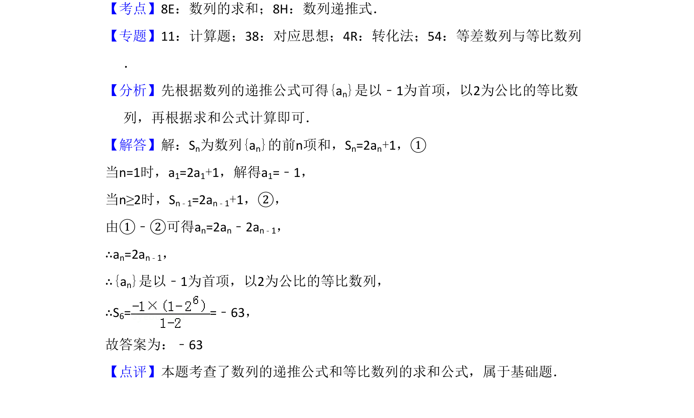

## 题面

## 摘要

利用递推关系式求得等比数列，再求前6项和。

## 关联考点

- [[894-数列递推式|数列递推式]]
- [[1067-等比数列的定义与通项公式|等比数列]]
- [[1081-累加求和|数列求和]]

## 答案与解析

> 📄 原 PDF 第 11 页：`素材/真题/湖南/2008-2024·（湖南）数学高考真题/2018年高考数学试卷（理）（新课标Ⅰ）（解析卷）.pdf`
