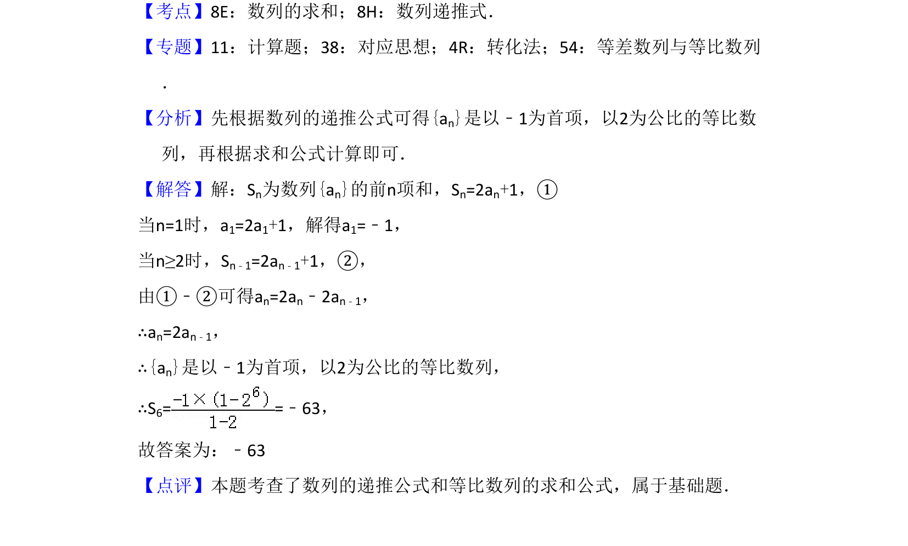

## 题面

## 摘要

利用递推关系式求得等比数列，再求前6项和。

## 关联考点

- [[894-数列递推式|数列递推式]]
- [[1067-等比数列的定义与通项公式|等比数列]]
- [[1081-累加求和|数列求和]]

## 答案与解析

> 📄 原 PDF 第 11 页：`素材/真题/湖南/2008-2024·（湖南）数学高考真题/2018年高考数学试卷（理）（新课标Ⅰ）（解析卷）.pdf`

<!-- 题干文本-start -->
## 题干文本
14．（5分）记Sn为数列{an}的前n项和．若Sn=2an+1，则S6=　﹣63　．
<!-- 题干文本-end -->

<!-- 解析文本-start -->
## 解析文本
【考点】8E：数列的求和；8H：数列递推式．菁优网版权所有
【专题】11：计算题；38：对应思想；4R：转化法；54：等差数列与等比数列
．
【分析】先根据数列的递推公式可得{an}是以﹣1为首项，以2为公比的等比数
列，再根据求和公式计算即可．
【解答】解：Sn为数列{an}的前n项和，Sn=2an+1，①
当n=1时，a1=2a1+1，解得a1=﹣1，
当n≥2时，Sn﹣1=2an﹣1+1，②，
由①﹣②可得an=2an﹣2an﹣1，
∴an=2an﹣1，
∴{an}是以﹣1为首项，以2为公比的等比数列，
∴S6= =﹣63，
故答案为：﹣63
【点评】本题考查了数列的递推公式和等比数列的求和公式，属于基础题．
<!-- 解析文本-end -->
