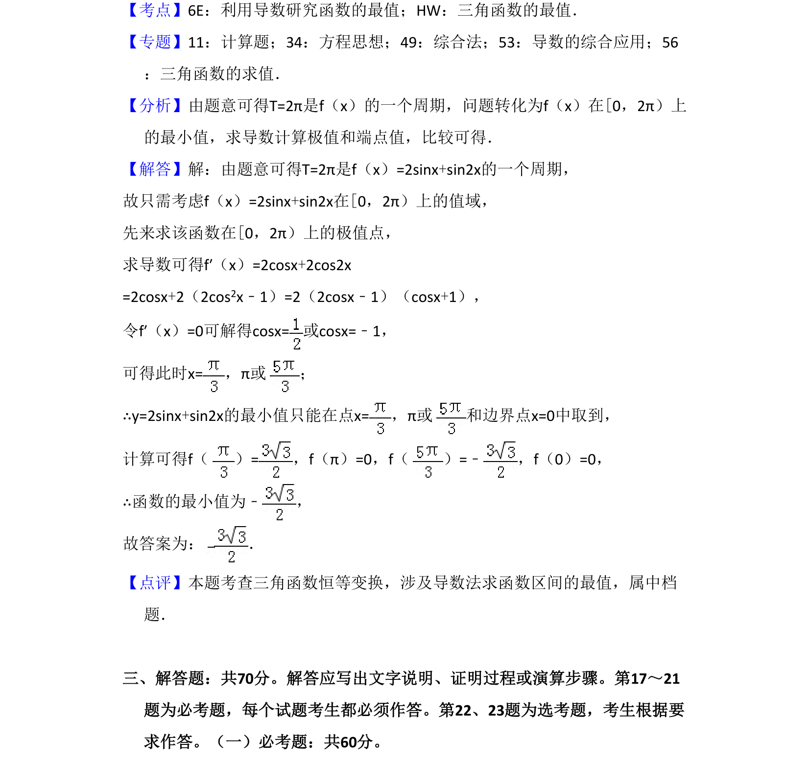

## 题面

## 摘要

求三角函数f(x)=2sinx+sin2x的最小值，利用周期性和导数分析极值点并比较。

## 关联考点

- [[706-利用导数研究函数的最值|利用导数研究函数的最值]]
- [[615-三角函数的最值|三角函数的最值]]

## 答案与解析

> 📄 原 PDF 第 12 页：`素材/真题/湖南/2008-2024·（湖南）数学高考真题/2018年高考数学试卷（理）（新课标Ⅰ）（解析卷）.pdf`
