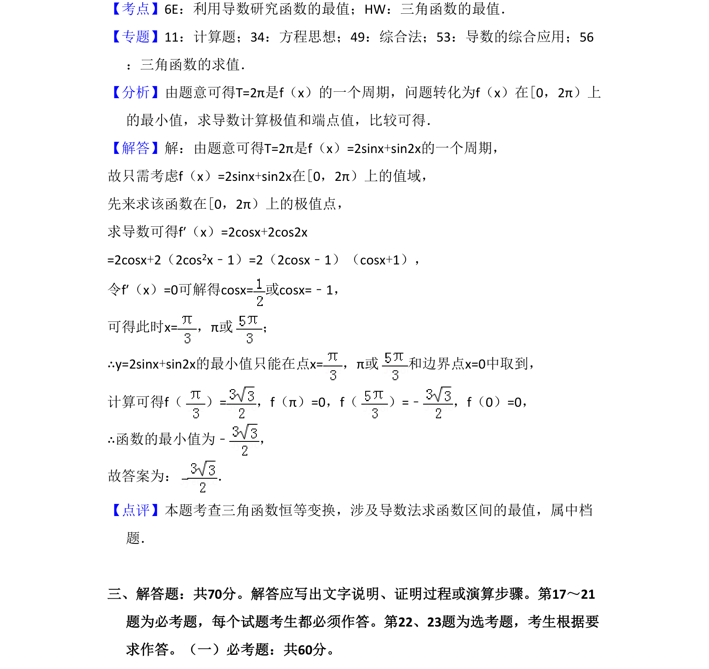

## 题面

## 摘要

求三角函数f(x)=2sinx+sin2x的最小值，利用周期性和导数分析极值点并比较。

## 关联考点

- [[706-利用导数研究函数的最值|利用导数研究函数的最值]]
- [[615-三角函数的最值|三角函数的最值]]

## 答案与解析

> 📄 原 PDF 第 12 页：`素材/真题/湖南/2008-2024·（湖南）数学高考真题/2018年高考数学试卷（理）（新课标Ⅰ）（解析卷）.pdf`

<!-- 题干文本-start -->
## 题干文本
16．（5分）已知函数f（x）=2sinx+sin2x，则f（x）的最小值是　 　．
<!-- 题干文本-end -->

<!-- 解析文本-start -->
## 解析文本
【考点】6E：利用导数研究函数的最值；HW：三角函数的最值．菁优网版权所有
【专题】11：计算题；34：方程思想；49：综合法；53：导数的综合应用；56
：三角函数的求值．
【分析】由题意可得T=2π是f（x）的一个周期，问题转化为f（x）在[0，2π）上
的最小值，求导数计算极值和端点值，比较可得．
【解答】解：由题意可得T=2π是f（x）=2sinx+sin2x的一个周期，
故只需考虑f（x）=2sinx+sin2x在[0，2π）上的值域，
先来求该函数在[0，2π）上的极值点，
求导数可得f′（x）=2cosx+2cos2x
=2cosx+2（2cos2x﹣1）=2（2cosx﹣1）（cosx+1），
令f′（x）=0可解得cosx=或cosx=﹣1，
可得此时x=，π或 ；
∴y=2sinx+sin2x的最小值只能在点x=，π或 和边界点x=0中取到，
计算可得f（ ）=，f（π）=0，f（ ）=﹣ ，f（0）=0，
∴函数的最小值为﹣ ，
故答案为： ．
【点评】本题考查三角函数恒等变换，涉及导数法求函数区间的最值，属中档
题．
　
三、解答题：共70分。解答应写出文字说明、证明过程或演算步骤。第17～21
题为必考题，每个试题考生都必须作答。第22、23题为选考题，考生根据要
求作答。（一）必考题：共60分。
<!-- 解析文本-end -->
