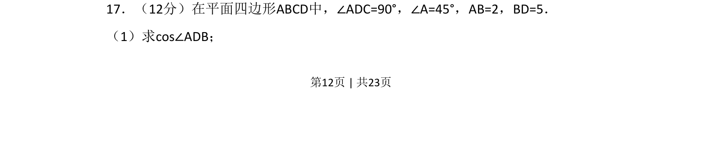
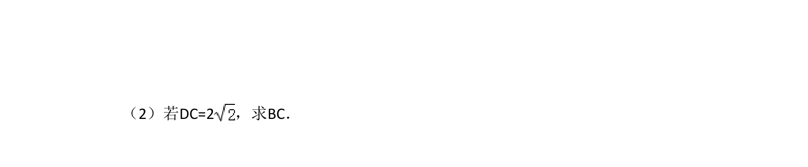
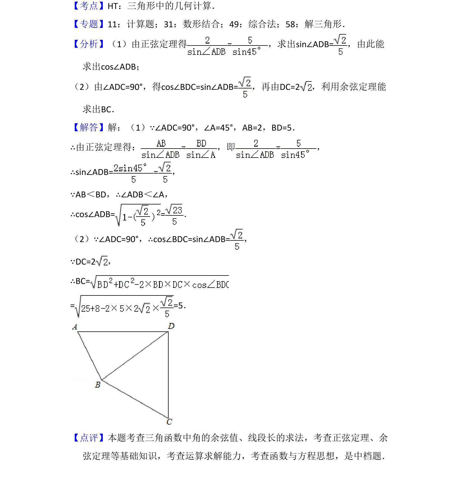

## 题面

## 摘要

（1）主要考查在平面四边形中利用几何关系求解角的余弦值，涉及解三角形与角度计算。

## 关联考点

- [[589-解三角形|解三角形]]
- [[126-定理|余弦定理]]
- [[角度计算]]

## 答案与解析

> 📄 原 PDF 第 12 页：`素材/真题/湖南/2008-2024·（湖南）数学高考真题/2018年高考数学试卷（理）（新课标Ⅰ）（解析卷）.pdf`
