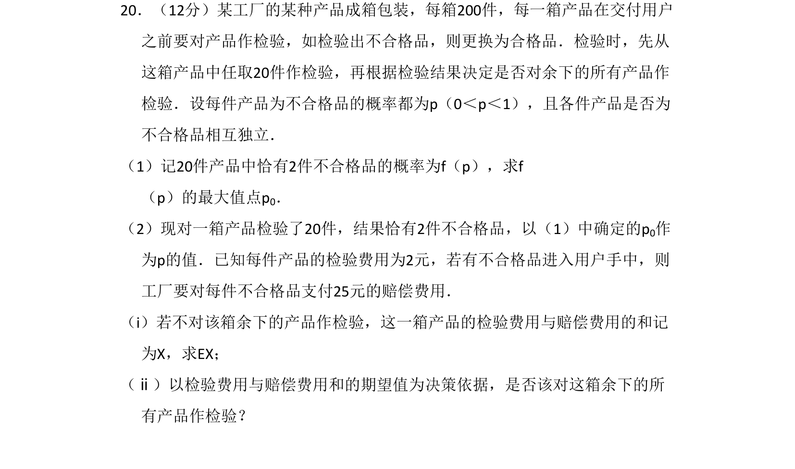
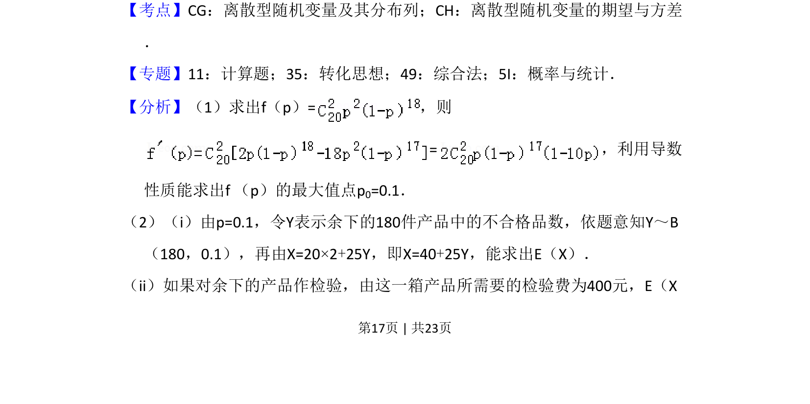
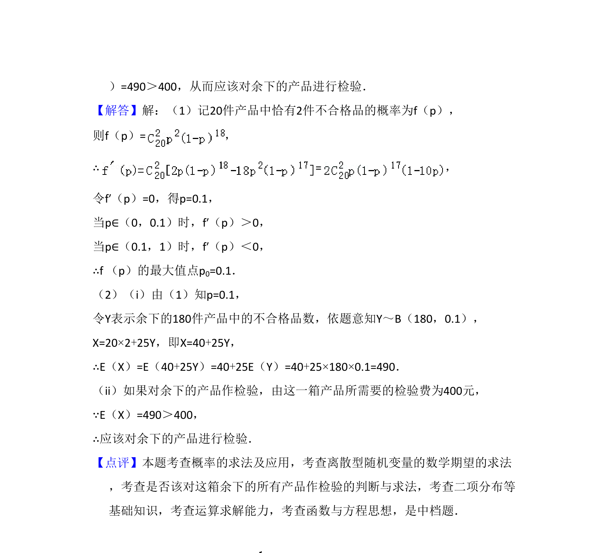

## 题面

## 摘要

考查二项分布概率及导数求最值，计算离散型随机变量期望并基于期望进行决策。

## 关联考点

- [[469-二项分布|二项分布]]
- [[1039-离散型随机变量的期望|离散型随机变量的期望]]
- [[840-导数求最值|导数求最值]]
- [[1330-离散型随机变量及其分布列|分布列]]

## 答案与解析

> 📄 原 PDF 第 17 页：`素材/真题/湖南/2008-2024·（湖南）数学高考真题/2018年高考数学试卷（理）（新课标Ⅰ）（解析卷）.pdf`
