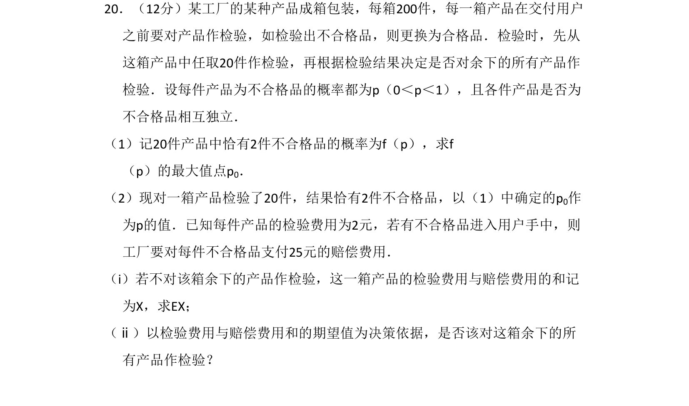
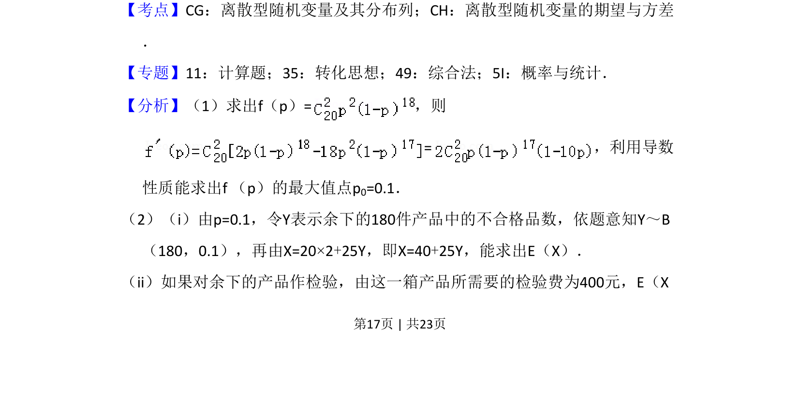
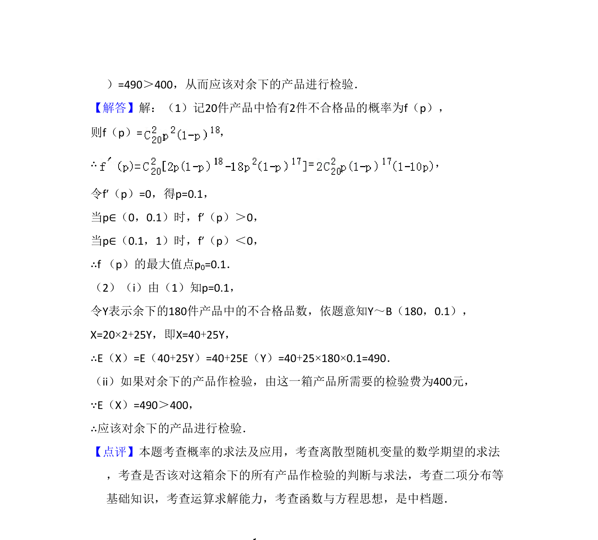

## 题面

## 摘要

考查二项分布概率及导数求最值，计算离散型随机变量期望并基于期望进行决策。

## 关联考点

- [[469-二项分布|二项分布]]
- [[501-离散型随机变量期望|离散型随机变量的期望]]
- [[840-导数求最值|导数求最值]]
- [[1330-离散型随机变量及其分布列|分布列]]

## 答案与解析

> 📄 原 PDF 第 17 页：`素材/真题/湖南/2008-2024·（湖南）数学高考真题/2018年高考数学试卷（理）（新课标Ⅰ）（解析卷）.pdf`

<!-- 题干文本-start -->
## 题干文本
20．（12分）某工厂的某种产品成箱包装，每箱200件，每一箱产品在交付用户
之前要对产品作检验，如检验出不合格品，则更换为合格品．检验时，先从
这箱产品中任取20件作检验，再根据检验结果决定是否对余下的所有产品作
检验．设每件产品为不合格品的概率都为p（0＜p＜1），且各件产品是否为
不合格品相互独立．
（1）记20件产品中恰有2件不合格品的概率为f（p），求f 
（p）的最大值点p0．
（2）现对一箱产品检验了20件，结果恰有2件不合格品，以（1）中确定的p0作
为p的值．已知每件产品的检验费用为2元，若有不合格品进入用户手中，则
工厂要对每件不合格品支付25元的赔偿费用．
（i）若不对该箱余下的产品作检验，这一箱产品的检验费用与赔偿费用的和记
为X，求EX；
（ⅱ）以检验费用与赔偿费用和的期望值为决策依据，是否该对这箱余下的所
有产品作检验？
<!-- 题干文本-end -->

<!-- 解析文本-start -->
## 解析文本
【考点】CG：离散型随机变量及其分布列；CH：离散型随机变量的期望与方差
．菁优网版权所有
【专题】11：计算题；35：转化思想；49：综合法；5I：概率与统计．
【分析】（1）求出f（p）=，则
=，利用导数
性质能求出f （p）的最大值点p0=0.1．
（2）（i）由p=0.1，令Y表示余下的180件产品中的不合格品数，依题意知Y～B
（180，0.1），再由X=20×2+25Y，即X=40+25Y，能求出E（X）．
（ii）如果对余下的产品作检验，由这一箱产品所需要的检验费为400元，E（X
<!-- 解析文本-end -->
