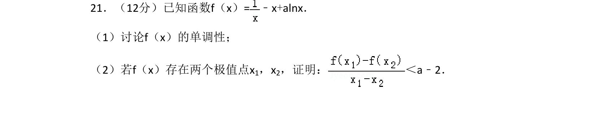
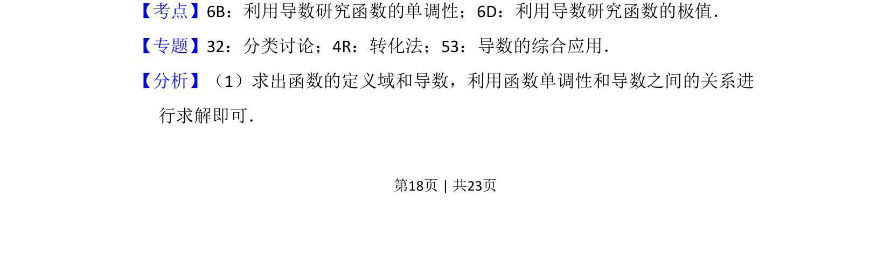
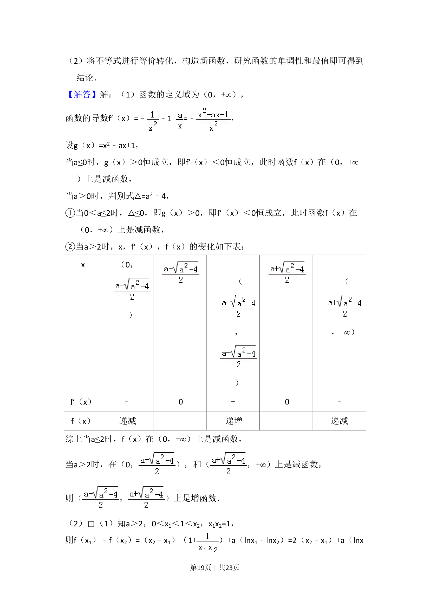
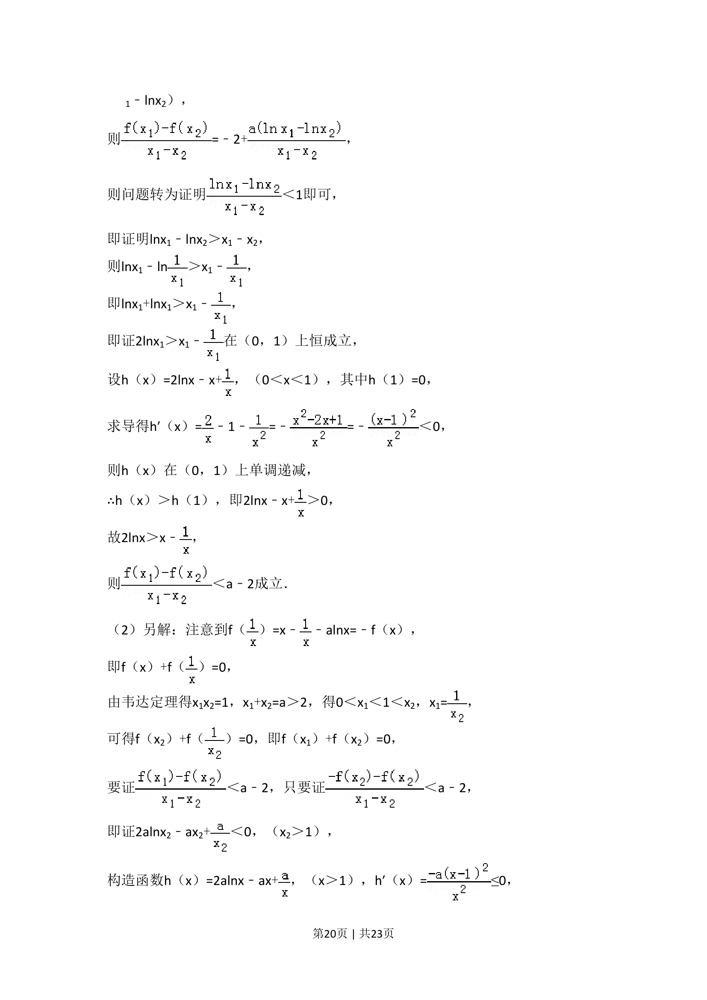
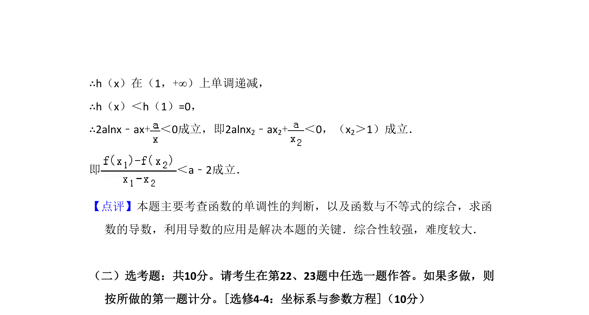

## 题面

## 摘要

本题考查含参函数的单调性讨论及极值点偏移不等式的证明。

## 关联考点

- [[705-利用导数研究函数的单调性|利用导数研究函数的单调性]]
- [[707-利用导数研究函数的极值|利用导数研究函数的极值]]

## 答案与解析

> 📄 原 PDF 第 18 页：`素材/真题/湖南/2008-2024·（湖南）数学高考真题/2018年高考数学试卷（理）（新课标Ⅰ）（解析卷）.pdf`

<!-- 题干文本-start -->
## 题干文本
21．（12分）已知函数f（x）=﹣x+alnx．
（1）讨论f（x）的单调性；
（2）若f（x）存在两个极值点x1，x2，证明： ＜a﹣2．
<!-- 题干文本-end -->

<!-- 解析文本-start -->
## 解析文本
【考点】6B：利用导数研究函数的单调性；6D：利用导数研究函数的极值．菁优网版权所有
【专题】32：分类讨论；4R：转化法；53：导数的综合应用．
【分析】（1）求出函数的定义域和导数，利用函数单调性和导数之间的关系进
行求解即可．
<!-- 解析文本-end -->
