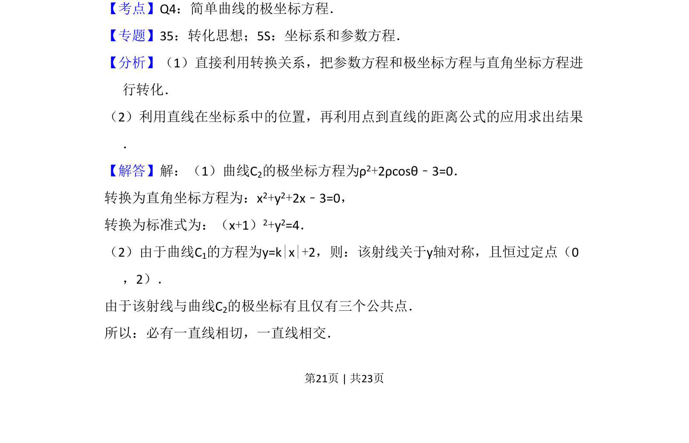
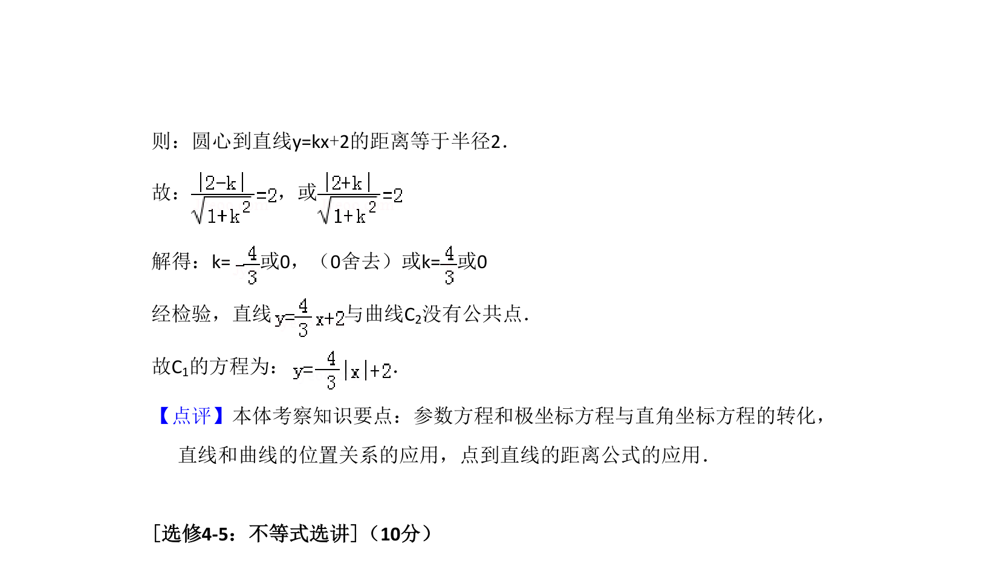

## 题面

## 摘要

极坐标方程与直角坐标方程的互化，直线与圆的位置关系及公共点个数问题

## 关联考点

- [[920-极坐标与直角坐标互化|极坐标与直角坐标互化]]
- [[782-圆的方程|圆的方程]]
- [[绝对值函数图像]]
- [[1004-直线与圆相切|直线与圆相切]]

## 答案与解析

> 📄 原 PDF 第 21 页：`素材/真题/湖南/2008-2024·（湖南）数学高考真题/2018年高考数学试卷（理）（新课标Ⅰ）（解析卷）.pdf`
