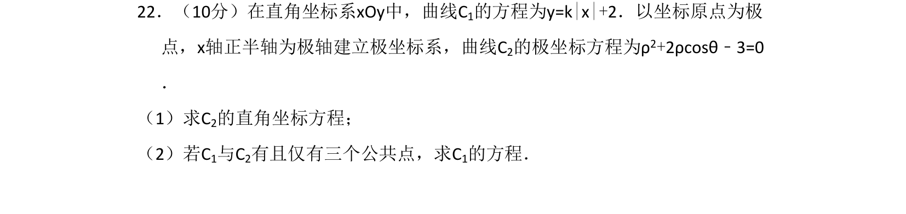
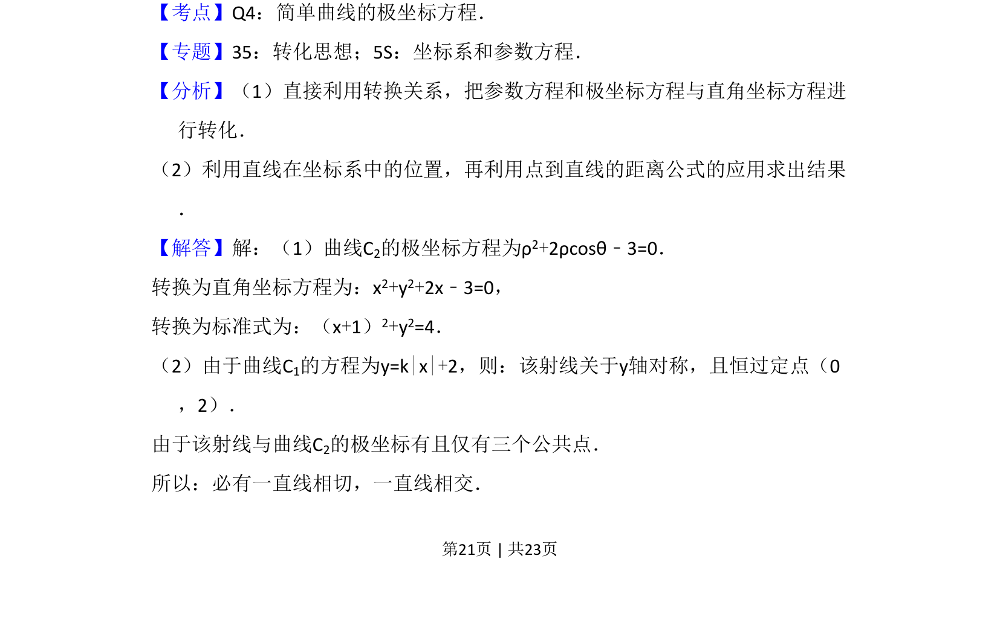
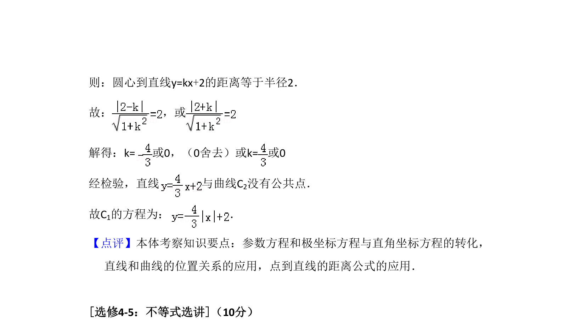

## 题面

## 摘要

极坐标方程与直角坐标方程的互化，直线与圆的位置关系及公共点个数问题

## 关联考点

- [[920-极坐标与直角坐标互化|极坐标与直角坐标互化]]
- [[782-圆的方程|圆的方程]]
- [[绝对值函数图像]]
- [[1004-直线与圆相切|直线与圆相切]]

## 答案与解析

> 📄 原 PDF 第 21 页：`素材/真题/湖南/2008-2024·（湖南）数学高考真题/2018年高考数学试卷（理）（新课标Ⅰ）（解析卷）.pdf`

<!-- 题干文本-start -->
## 题干文本
22．（10分）在直角坐标系xOy中，曲线C1的方程为y=k|x|+2．以坐标原点为极
点，x轴正半轴为极轴建立极坐标系，曲线C2的极坐标方程为ρ2+2ρcosθ﹣3=0
．
（1）求C2的直角坐标方程；
（2）若C1与C2有且仅有三个公共点，求C1的方程．
<!-- 题干文本-end -->

<!-- 解析文本-start -->
## 解析文本
【考点】Q4：简单曲线的极坐标方程．菁优网版权所有
【专题】35：转化思想；5S：坐标系和参数方程．
【分析】（1）直接利用转换关系，把参数方程和极坐标方程与直角坐标方程进
行转化．
（2）利用直线在坐标系中的位置，再利用点到直线的距离公式的应用求出结果
．
【解答】解：（1）曲线C2的极坐标方程为ρ2+2ρcosθ﹣3=0．
转换为直角坐标方程为：x2+y2+2x﹣3=0，
转换为标准式为：（x+1）2+y2=4．
（2）由于曲线C1的方程为y=k|x|+2，则：该射线关于y轴对称，且恒过定点（0
，2）．
由于该射线与曲线C2的极坐标有且仅有三个公共点．
所以：必有一直线相切，一直线相交．
<!-- 解析文本-end -->
