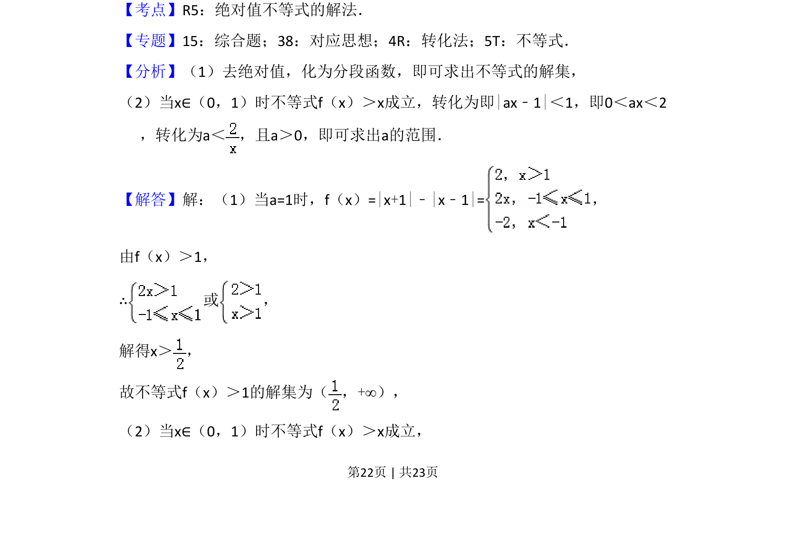
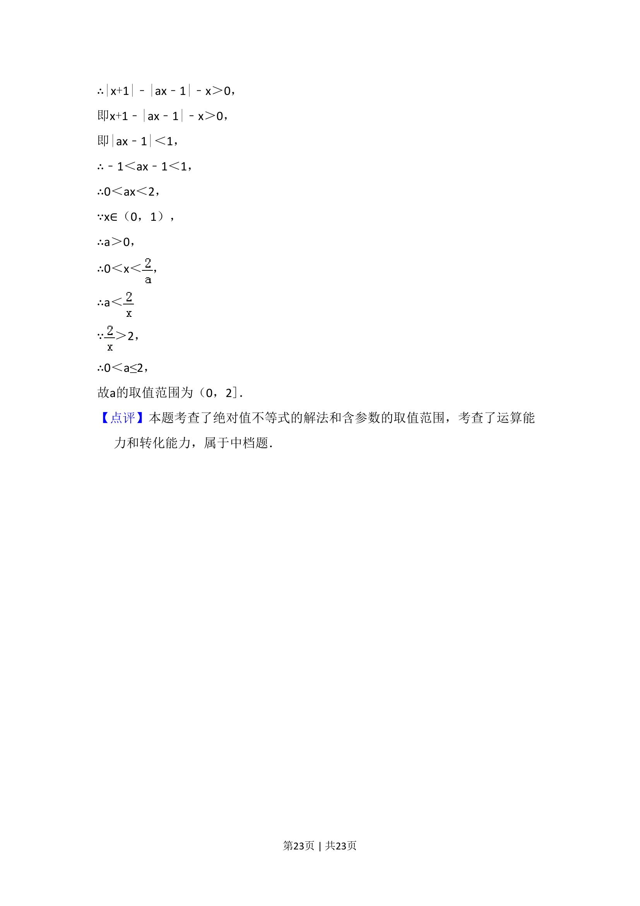

## 题面

## 摘要

本题分为两问，考查含绝对值不等式的求解及根据不等式恒成立求参数范围，涉及分段函数与分类讨论。

## 关联考点

- [[1093-绝对值不等式的解法|绝对值不等式的解法]]
- [[290-分段函数|分段函数]]
- [[531-不等式恒成立|不等式恒成立]]
- [[转化与化归]]

## 答案与解析

> 📄 原 PDF 第 22 页：`素材/真题/湖南/2008-2024·（湖南）数学高考真题/2018年高考数学试卷（理）（新课标Ⅰ）（解析卷）.pdf`

<!-- 题干文本-start -->
## 题干文本
23．已知f（x）=|x+1|﹣|ax﹣1|．
（1）当a=1时，求不等式f（x）＞1的解集；
（2）若x∈（0，1）时不等式f（x）＞x成立，求a的取值范围．
<!-- 题干文本-end -->

<!-- 解析文本-start -->
## 解析文本
【考点】R5：绝对值不等式的解法．菁优网版权所有
【专题】15：综合题；38：对应思想；4R：转化法；5T：不等式．
【分析】（1）去绝对值，化为分段函数，即可求出不等式的解集，
（2）当x∈（0，1）时不等式f（x）＞x成立，转化为即|ax﹣1|＜1，即0＜ax＜2
，转化为a＜ ，且a＞0，即可求出a的范围．
【解答】解：（1）当a=1时，f（x）=|x+1|﹣|x﹣1|=，
由f（x）＞1，
∴或 ，
解得x＞ ，
故不等式f（x）＞1的解集为（ ，+∞），
（2）当x∈（0，1）时不等式f（x）＞x成立，
<!-- 解析文本-end -->
