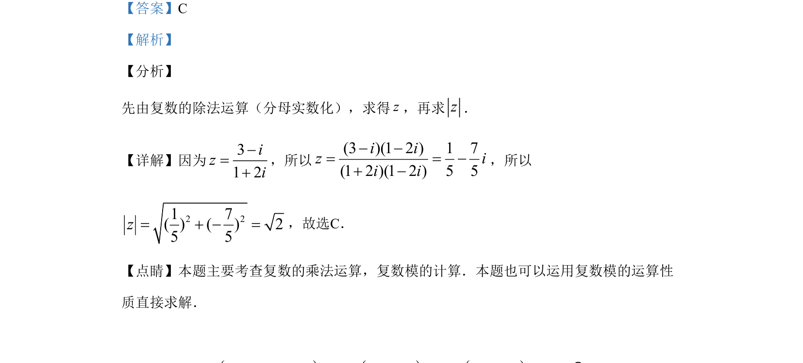

## 题面

## 摘要

复数除法与模的计算，考查复数化简及模长公式的直接应用。

## 关联考点

- [[复数的除法运算]]
- [[复数模的计算]]

## 答案与解析

> 📄 原 PDF 第 1 页：`素材/真题/湖南/2008-2024·（湖南）数学高考真题/2019年高考数学试卷（文）（新课标Ⅰ）（解析卷）.pdf`

<!-- 题干文本-start -->
## 题干文本
1.设3 i1 2iz-=+
，则z=
A. 2 B. 3C. 2D. 1
<!-- 题干文本-end -->

<!-- 解析文本-start -->
## 解析文本
【答案】C
【解析】
【分析】
先由复数的除法运算（分母实数化），求得z，再求z．
【详解】因为31 2izi-=+
，所以
(3 )(1 2 ) 1 7(1 2 )(1 2 ) 5 5i iz ii i- -= = -+ -，所以
2 21 7( ) ( ) 25 5z= + - =，故选C．
【点睛】本题主要考查复数的乘法运算，复数模的计算．本题也可以运用复数模的运算性
质直接求解．
<!-- 解析文本-end -->
