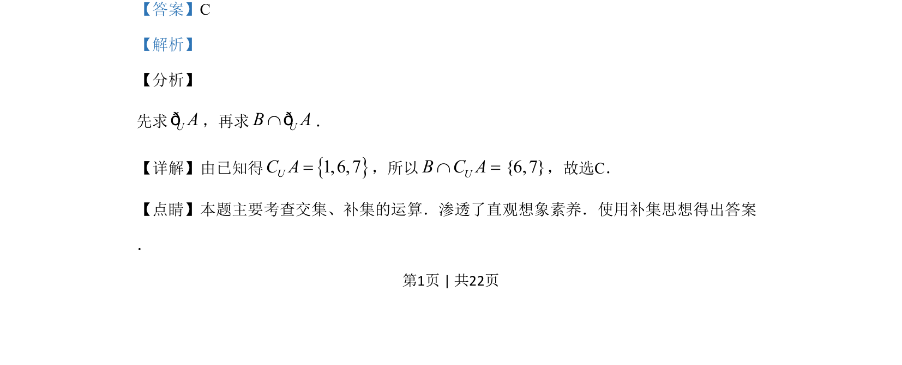

## 题面

## 摘要

本题主要考查集合的交集与补集运算，借助韦恩图或直接计算求解。

## 关联考点

- [[1222-交集|交集]]
- [[1101-补集|补集]]
- [[314-集合的运算|集合运算]]

## 答案与解析

> 📄 原 PDF 第 1 页：`素材/真题/湖南/2008-2024·（湖南）数学高考真题/2019年高考数学试卷（文）（新课标Ⅰ）（解析卷）.pdf`

<!-- 题干文本-start -->
## 题干文本
2.已知集合{}{}{}1, 2,3, 4,5,6,7 2,3, 4,5 2,3,6,7U A B= = =，，，则CUB AI
A. {}1,6B. {}1,7C. {}6,7D. {}1,6,7
<!-- 题干文本-end -->

<!-- 解析文本-start -->
## 解析文本
【答案】C
【解析】
【分析】
先求UAð，再求UB AÇð．
【详解】由已知得{}1,6,7UC A=，所以 UB C AÇ ={6,7}，故选C．
【点睛】本题主要考查交集、补集的运算．渗透了直观想象素养．使用补集思想得出答案
．
<!-- 解析文本-end -->
