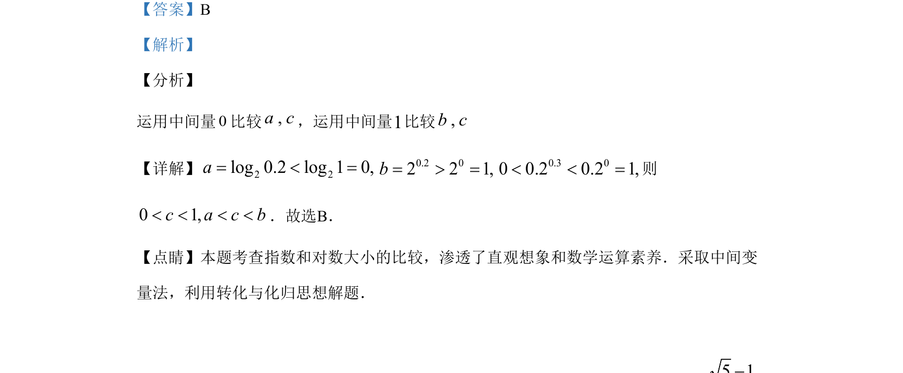

## 题面

## 摘要

比较对数与指数的大小，运用中间变量0和1及函数单调性。

## 关联考点

- [[298-对数函数|对数函数]]
- [[304-指数函数|指数函数]]
- [[889-数值比较|比较大小]]
- [[中间变量法]]

## 答案与解析

> 📄 原 PDF 第 2 页：`素材/真题/湖南/2008-2024·（湖南）数学高考真题/2019年高考数学试卷（文）（新课标Ⅰ）（解析卷）.pdf`
