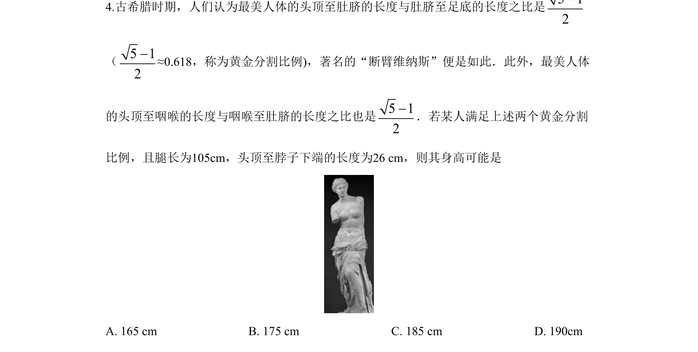
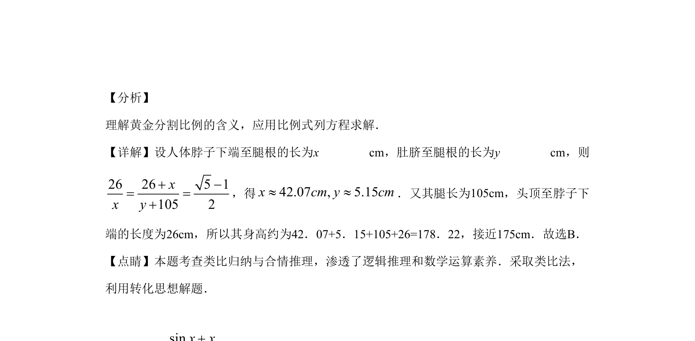

## 题面

## 摘要

本题考查黄金分割比例的应用，通过列方程求解身高并估算结果。

## 关联考点

- [[1419-黄金分割|黄金分割]]
- [[1414-比例方程|比例方程]]
- [[740-合情推理|合情推理]]

## 答案与解析

> 📄 原 PDF 第 2 页：`素材/真题/湖南/2008-2024·（湖南）数学高考真题/2019年高考数学试卷（文）（新课标Ⅰ）（解析卷）.pdf`
