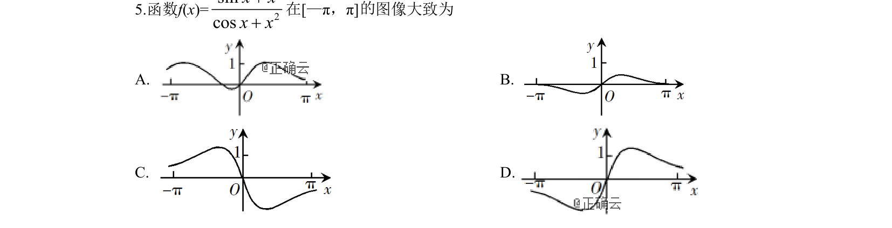
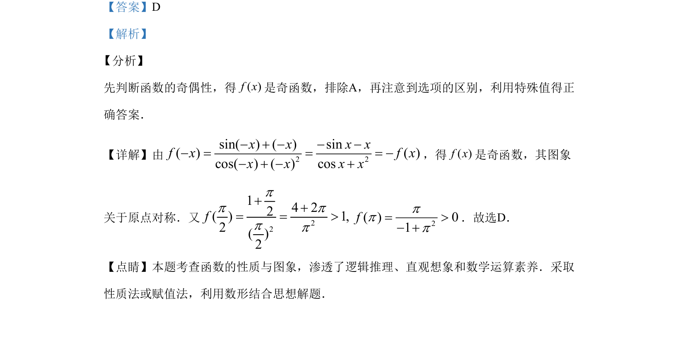

## 题面

## 摘要

本题通过判断函数奇偶性并结合特殊值排除法，确定函数图象的正确选项。

## 关联考点

- [[284-函数的奇偶性|函数的奇偶性]]
- [[函数图象的识别]]
- [[1116-赋值|特殊值法]]

## 答案与解析

> 📄 原 PDF 第 3 页：`素材/真题/湖南/2008-2024·（湖南）数学高考真题/2019年高考数学试卷（文）（新课标Ⅰ）（解析卷）.pdf`
