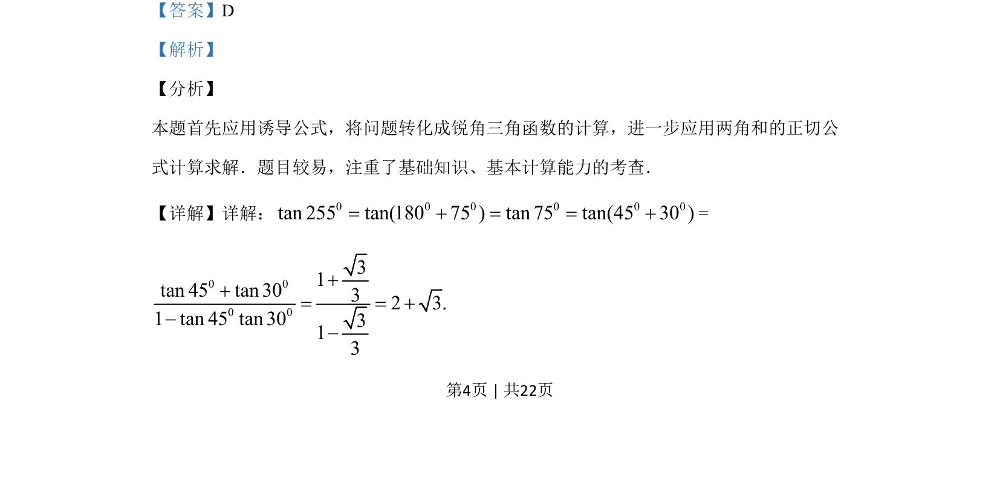
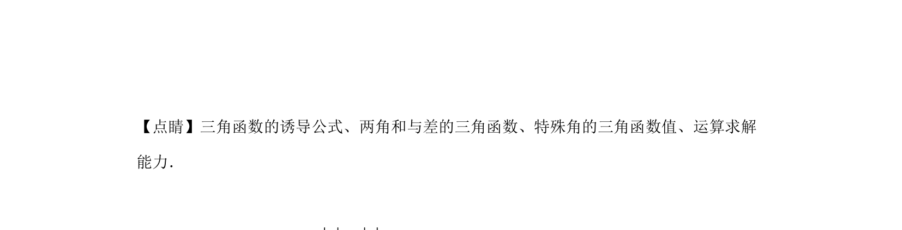

## 题面

## 摘要

利用诱导公式和两角和的正切公式求 tan255° 的值

## 关联考点

- [[1249-三角函数的诱导公式|诱导公式]]
- [[两角和的正切公式]]
- [[985-特殊角的三角函数值|特殊角的三角函数值]]

## 答案与解析

> 📄 原 PDF 第 4 页：`素材/真题/湖南/2008-2024·（湖南）数学高考真题/2019年高考数学试卷（文）（新课标Ⅰ）（解析卷）.pdf`
