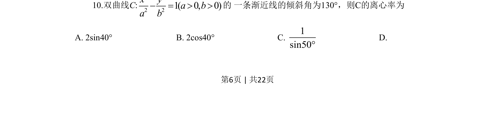
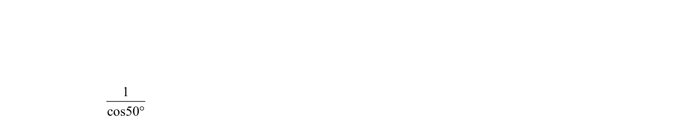
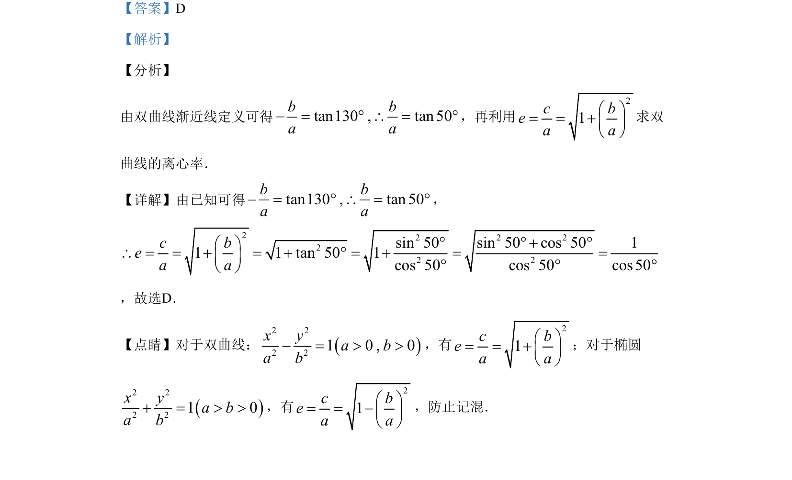

## 题面

## 摘要

由双曲线渐近线的倾斜角求离心率，通过渐近线斜率与三角函数关系化简计算。

## 关联考点

- [[369-双曲线渐近线|双曲线渐近线]]
- [[391-椭圆离心率|离心率]]
- [[741-同角三角函数基本关系|同角三角函数基本关系]]

## 答案与解析

> 📄 原 PDF 第 6 页：`素材/真题/湖南/2008-2024·（湖南）数学高考真题/2019年高考数学试卷（文）（新课标Ⅰ）（解析卷）.pdf`

<!-- 题干文本-start -->
## 题干文本
10.双曲线C:
2 22 21 ( 0, 0)x ya ba b- = > >的 一条渐近线的倾斜角为130°，则C的离心率为
A. 2sin40° B. 2cos40° C. 1sin50°
D.
<!-- 题干文本-end -->

<!-- 解析文本-start -->
## 解析文本

<!-- 解析文本-end -->
