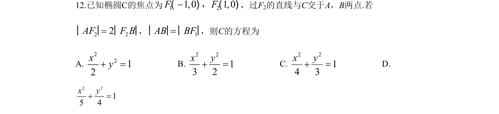
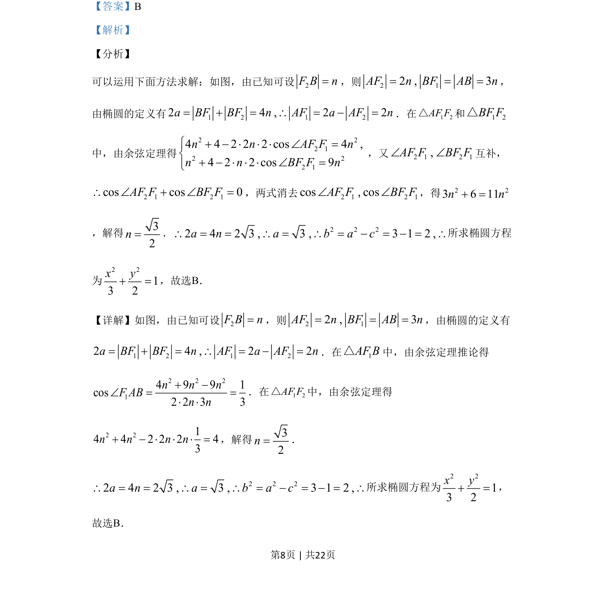
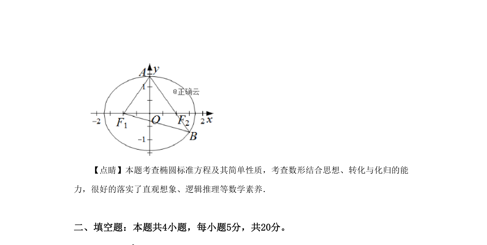

## 题面

## 摘要

通过椭圆定义与余弦定理联立求解椭圆方程。

## 关联考点

- [[1216-椭圆定义|椭圆定义]]
- [[126-定理|余弦定理]]
- [[941-椭圆标准方程|椭圆标准方程]]

## 答案与解析

> 📄 原 PDF 第 8 页：`素材/真题/湖南/2008-2024·（湖南）数学高考真题/2019年高考数学试卷（文）（新课标Ⅰ）（解析卷）.pdf`
