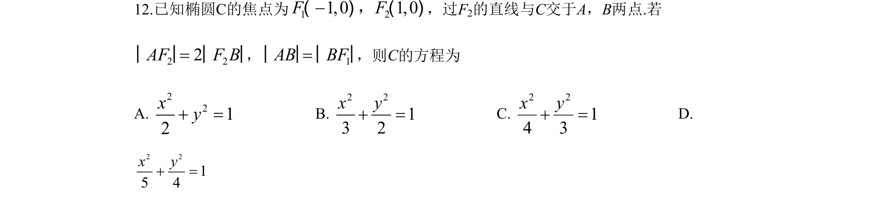
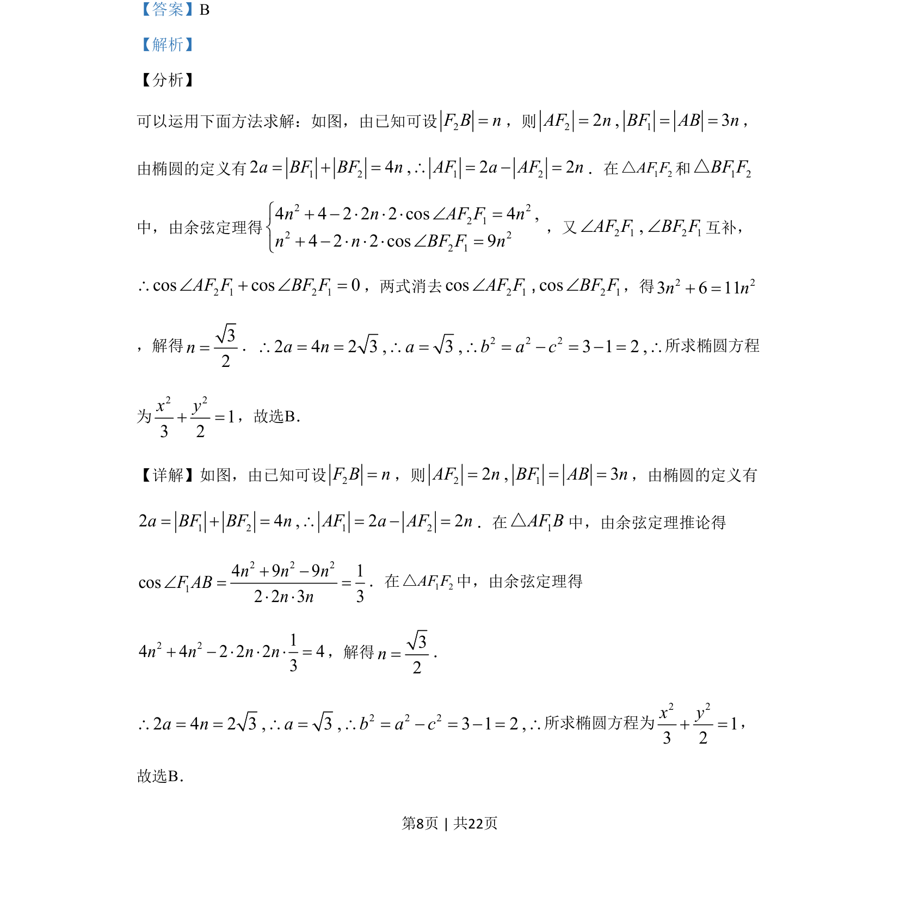
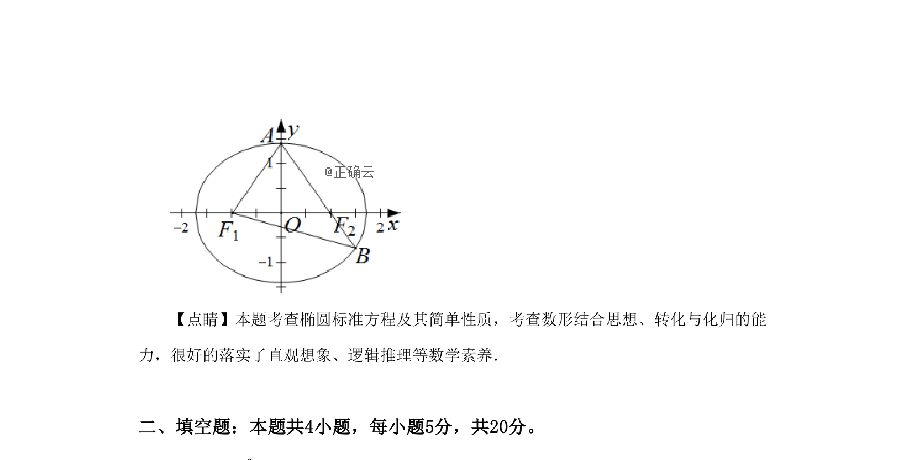

## 题面

## 摘要

通过椭圆定义与余弦定理联立求解椭圆方程。

## 关联考点

- [[1413-椭圆的定义|椭圆定义]]
- [[126-定理|余弦定理]]
- [[941-椭圆标准方程|椭圆标准方程]]

## 答案与解析

> 📄 原 PDF 第 8 页：`素材/真题/湖南/2008-2024·（湖南）数学高考真题/2019年高考数学试卷（文）（新课标Ⅰ）（解析卷）.pdf`

<!-- 题干文本-start -->
## 题干文本
12.已知椭圆C的焦点为1 21,0 1,0F F-( )，( )，过F2的直线与C交于A，B两点.若
2 22AF F B=││││， 1AB BF=││││，则C的方程为
A. 
2212xy+ =B. 
2 213 2x y+ =C. 
2 214 3x y+ =D. 
2 215 4x y+ =
<!-- 题干文本-end -->

<!-- 解析文本-start -->
## 解析文本
【答案】B
【解析】
【分析】
可以运用下面方法求解：如图，由已知可设2F B n=，则2 12 , 3AF n BF AB n= = =，
由椭圆的定义有 1 2 1 22 4 , 2 2a BF BF n AF a AF n= + = \ = - =．在1 2AF F△和1 2BF F△
中，由余弦定理得
2 22 12 22 14 4 2 2 2 cos 4 ,4 2 2 cos 9n n AF F nn n BF F nì+ - × × × Ð =í+ - × × × Ð =î
，又2 1 2 1,AF F BF FÐ Ð互补，
2 1 2 1cos cos 0AF F BF F\ Ð + Ð =，两式消去 2 1 2 1cos cosAF F BF FÐ Ð,，得2 23 6 11n n+ =
，解得32n=． 2 2 22 4 2 3 , 3 , 3 1 2 ,a n a b a c\ = = \ = \ = - = - = \所求椭圆方程
为
2 213 2x y+ =，故选B．
【详解】如图，由已知可设2F B n=，则2 12 , 3AF n BF AB n= = =，由椭圆的定义有
1 2 1 22 4 , 2 2a BF BF n AF a AF n= + = \ = - =．在1AF B△中，由余弦定理推论得
2 2 214 9 9 1cos2 2 3 3n n nF ABn n+ -Ð = =× ×
．在1 2AF F△中，由余弦定理得
2 214 4 2 2 2 43n n n n+ - × × × =，解得32n=．
2 2 22 4 2 3 , 3 , 3 1 2 ,a n a b a c\ = = \ = \ = - = - = \所求椭圆方程为
2 213 2x y+ =，
故选B．
<!-- 解析文本-end -->
