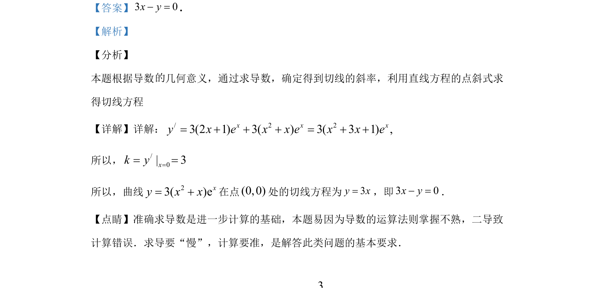

## 题面

## 摘要

利用导数几何意义求曲线切线方程，考查导数的运算法则与点斜式应用。

## 关联考点

- [[440-导数的几何意义|导数的几何意义]]
- [[422-切线方程|切线方程]]
- [[549-导数运算|导数运算]]

## 答案与解析

> 📄 原 PDF 第 9 页：`素材/真题/湖南/2008-2024·（湖南）数学高考真题/2019年高考数学试卷（文）（新课标Ⅰ）（解析卷）.pdf`

<!-- 题干文本-start -->
## 题干文本
13.曲线 23( )exy x x= +在点(0,0)处的切线方程为___________．
<!-- 题干文本-end -->

<!-- 解析文本-start -->
## 解析文本
【答案】3 0x y- =.
【解析】
【分析】
本题根据导数 几何意义，通过求导数，确定得到切线的斜率，利用直线方程的点斜式求
得切线方程
【详解】详解：/ 2 23(2 1) 3( ) 3( 3 1) ,x x xy x e x x e x x e= + + + = + +
所以，/0| 3xk y== =
所以，曲线 23( )exy x x= +在点(0,0)处的切线方程为3y x=，即3 0x y- =．
【点睛】准确求导数是进一步计算的基础，本题易因为导数的运算法则掌握不熟，二导致
计算错误．求导要“慢”，计算要准，是解答此类问题的基本要求．
<!-- 解析文本-end -->
