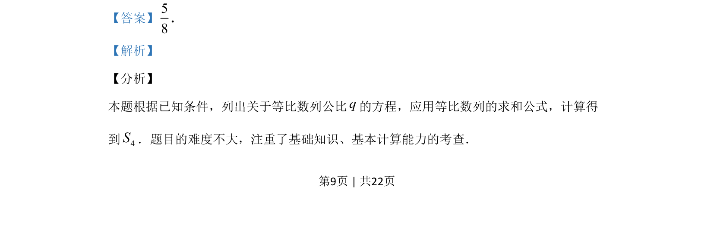
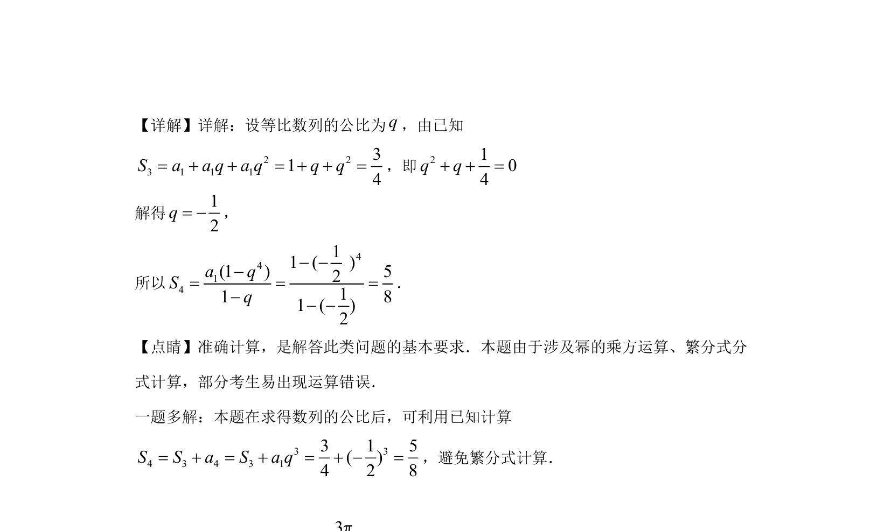

## 题面

## 摘要

本题通过已知等比数列前3项和求公比，再计算前4项和，考查基本运算能力。

## 关联考点

- [[1067-等比数列的定义与通项公式|等比数列]]
- [[1065-等比数列求和公式|等比数列求和公式]]
- [[061-方程|方程求解]]
- [[884-指数幂运算|幂运算]]

## 答案与解析

> 📄 原 PDF 第 9 页：`素材/真题/湖南/2008-2024·（湖南）数学高考真题/2019年高考数学试卷（文）（新课标Ⅰ）（解析卷）.pdf`
