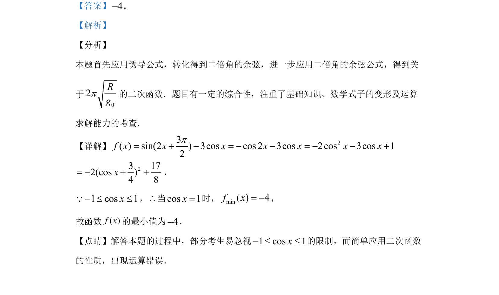

## 题面

## 摘要

三角恒等变换求正弦型函数最值，涉及诱导公式和二倍角公式，转化为二次函数并注意余弦有界性。

## 关联考点

- [[1249-三角函数的诱导公式|诱导公式]]
- [[637-二倍角公式|二倍角公式]]
- [[212-二次函数定义|二次函数]]
- [[余弦函数的有界性]]

## 答案与解析

> 📄 原 PDF 第 10 页：`素材/真题/湖南/2008-2024·（湖南）数学高考真题/2019年高考数学试卷（文）（新课标Ⅰ）（解析卷）.pdf`
