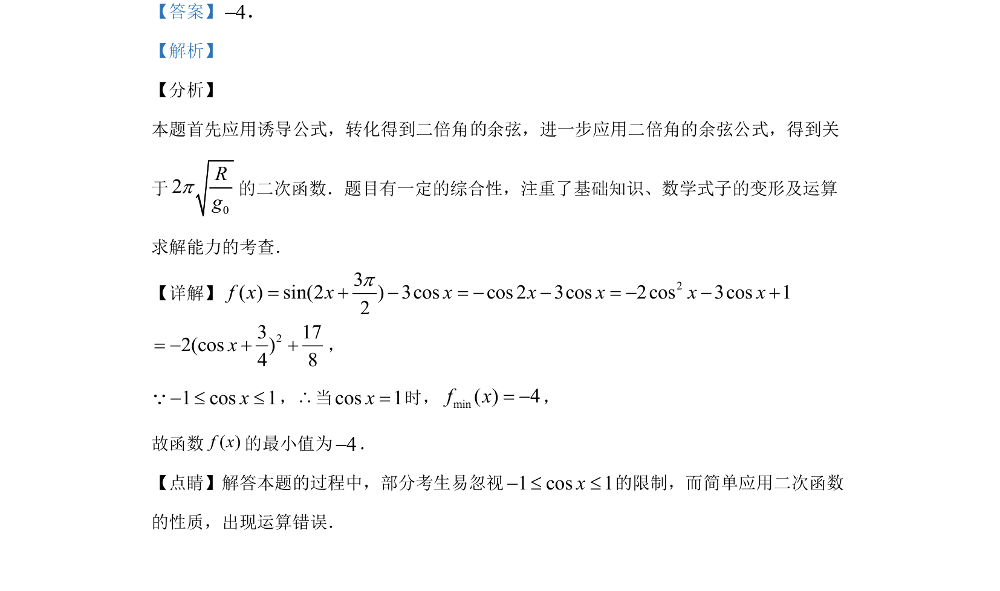

## 题面

## 摘要

三角恒等变换求正弦型函数最值，涉及诱导公式和二倍角公式，转化为二次函数并注意余弦有界性。

## 关联考点

- [[1249-三角函数的诱导公式|诱导公式]]
- [[637-二倍角公式|二倍角公式]]
- [[212-二次函数定义|二次函数]]
- [[余弦函数的有界性]]

## 答案与解析

> 📄 原 PDF 第 10 页：`素材/真题/湖南/2008-2024·（湖南）数学高考真题/2019年高考数学试卷（文）（新课标Ⅰ）（解析卷）.pdf`

<!-- 题干文本-start -->
## 题干文本
15.函数 3π( ) sin(2 ) 3cos2f x x x= + -的最小值为___________．
<!-- 题干文本-end -->

<!-- 解析文本-start -->
## 解析文本
【答案】4-.
【解析】
【分析】
本题首先应用诱导公式，转化得到二倍角 余弦，进一步应用二倍角的余弦公式，得到关
于
02Rg的二次函数．题目有一定的综合性，注重了基础知识、数学式子的变形及运算
求解能力的考查．
【详解】 23( ) sin(2 ) 3cos cos 2 3cos 2cos 3cos 12f x x x x x x x= + - = - - = - - +23 172(cos )4 8x= - + +，
1 cos 1x- £ £Q，\当cos 1x=时，min( ) 4f x= -，
故函数( )f x的最小值为4-．
【点睛】解答本题的过程中，部分考生易忽视1 cos 1x- £ £的限制，而简单应用二次函数
的性质，出现运算错误．
<!-- 解析文本-end -->
