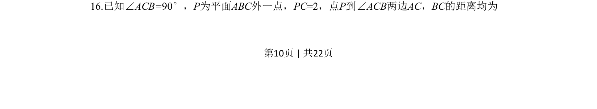
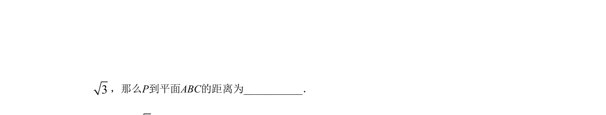
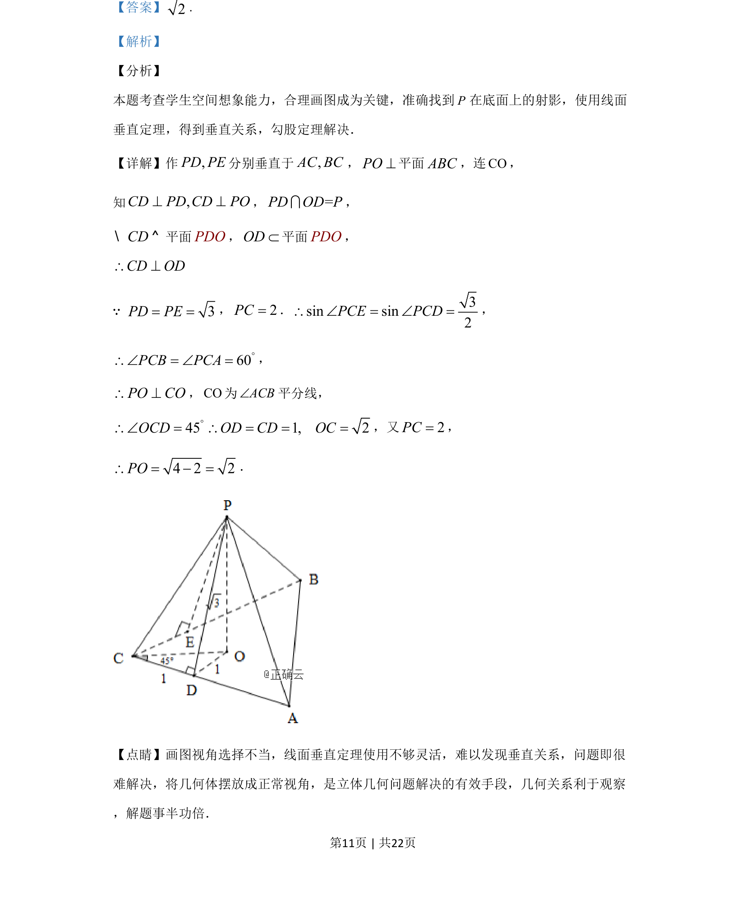
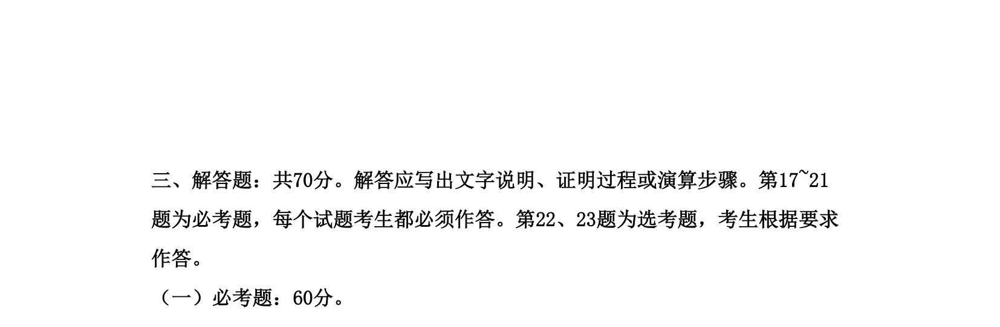

## 题面

## 摘要

本题考查空间几何中线面垂直与射影的应用，通过作垂线找到点在平面上的射影，利用垂直关系和勾股定理求线段长。

## 关联考点

- [[1086-线面垂直的判定与性质|线面垂直]]
- [[射影]]
- [[189-勾股定理|勾股定理]]
- [[1053-空间想象|空间想象]]

## 答案与解析

> 📄 原 PDF 第 10 页：`素材/真题/湖南/2008-2024·（湖南）数学高考真题/2019年高考数学试卷（文）（新课标Ⅰ）（解析卷）.pdf`
