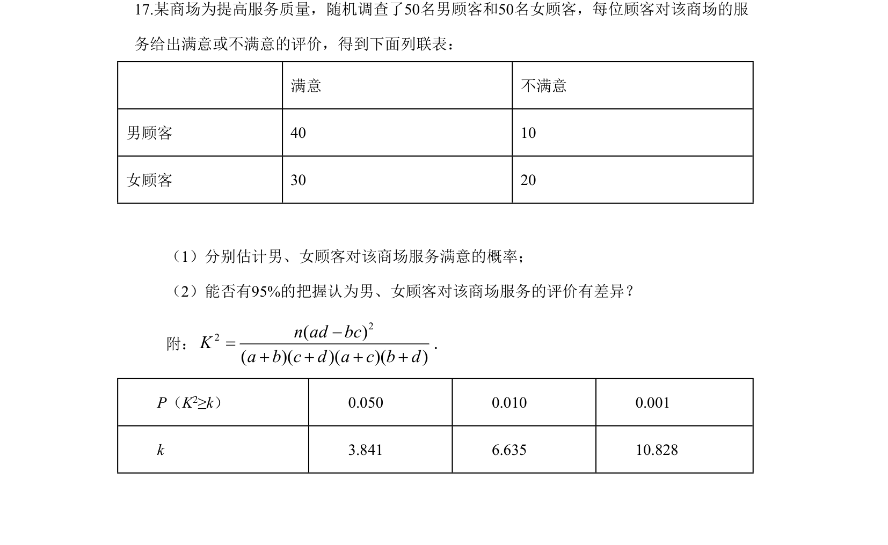
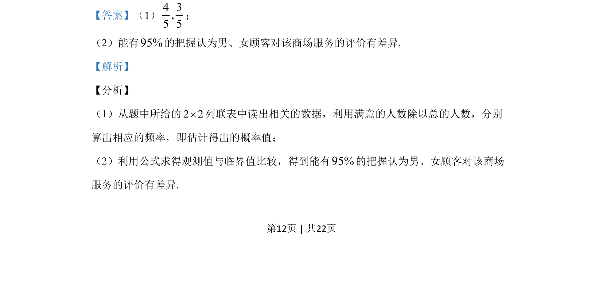
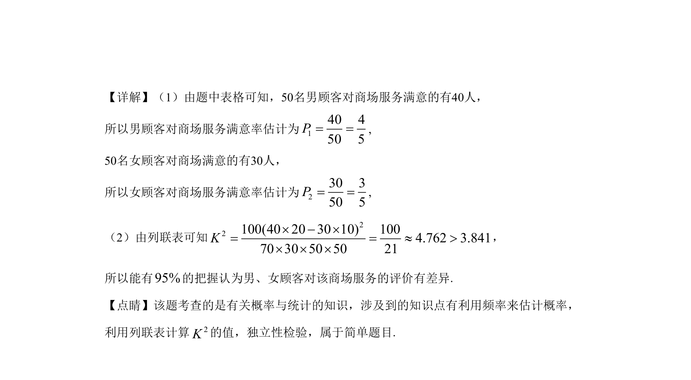

## 题面

## 摘要

该题通过2×2列联表数据估计满意率，并利用卡方检验判断性别与评价的差异显著性

## 关联考点

- [[1187-频率估计概率|频率估计概率]]
- [[497-独立性检验|独立性检验]]
- [[479-卡方公式|卡方统计量]]

## 答案与解析

> 📄 原 PDF 第 12 页：`素材/真题/湖南/2008-2024·（湖南）数学高考真题/2019年高考数学试卷（文）（新课标Ⅰ）（解析卷）.pdf`
