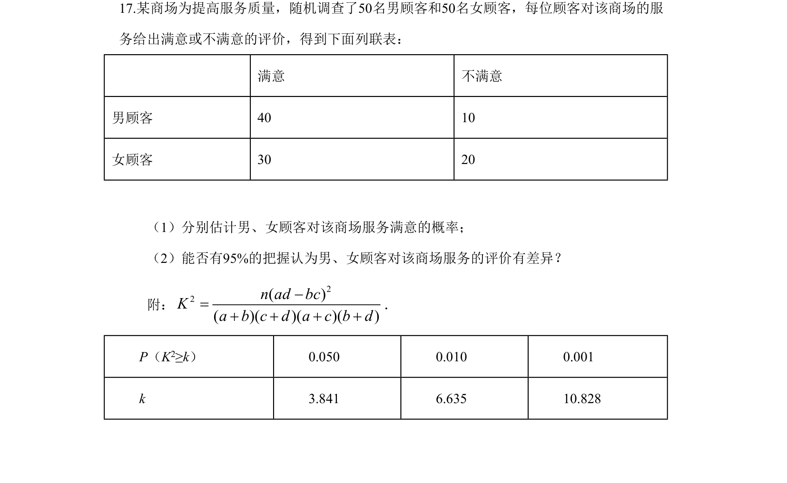
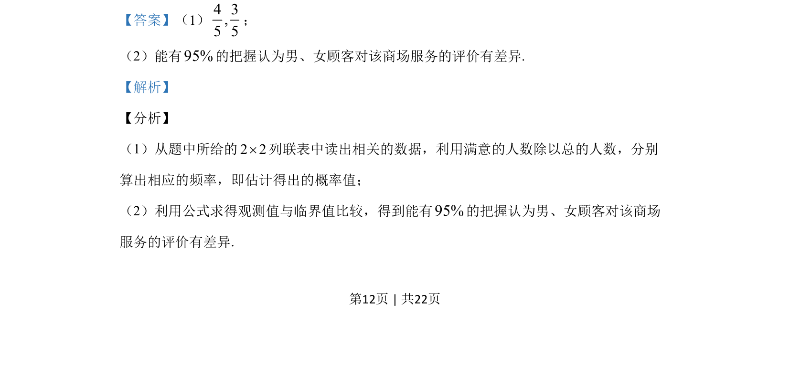
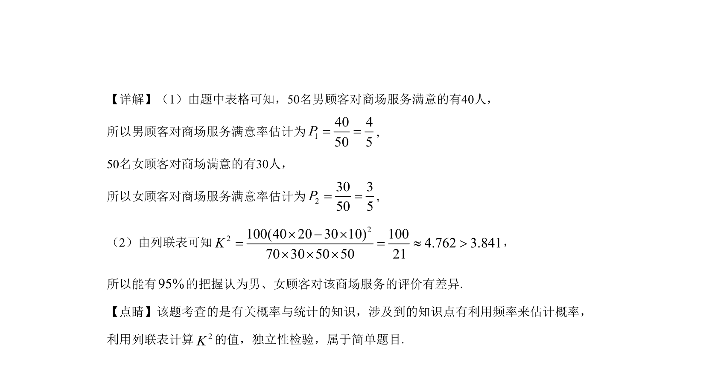

## 题面

## 摘要

该题通过2×2列联表数据估计满意率，并利用卡方检验判断性别与评价的差异显著性

## 关联考点

- [[1187-频率估计概率|频率估计概率]]
- [[497-独立性检验|独立性检验]]
- [[479-卡方公式|卡方统计量]]

## 答案与解析

> 📄 原 PDF 第 12 页：`素材/真题/湖南/2008-2024·（湖南）数学高考真题/2019年高考数学试卷（文）（新课标Ⅰ）（解析卷）.pdf`

<!-- 题干文本-start -->
## 题干文本
17.某商场为提高服务质量，随机调查了50名男顾客和50名女顾客，每位顾客对该商场的服
务给出满意或不满意的评价，得到下面列联表：
满意 不满意
男顾客 40 10
女顾客 30 20
（1）分别估计男、女顾客对该商场服务满意的概率；
（2）能否有95%的把握认为男、女顾客对该商场服务的评价有差异？
附：
22( )( )( )( )( )n ad bcKa b c d a c b d-=+ + + +
．
P（K2≥k） 0.050 0.010 0.001
k 3.841 6.635 10.828
<!-- 题干文本-end -->

<!-- 解析文本-start -->
## 解析文本
【答案】（1）4 3,5 5
；
（2）能有95%的把握认为男、女顾客对该商场服务的评价有差异.
【解析】
【分析】
（1）从题中所给的2 2´列联表中读出相关的数据，利用满意的人数除以总的人数，分别
算出相应的频率，即估计得出的概率值；
（2）利用公式求得观测值与临界值比较，得到能有95%的把握认为男、女顾客对该商场
服务的评价有差异.
<!-- 解析文本-end -->
