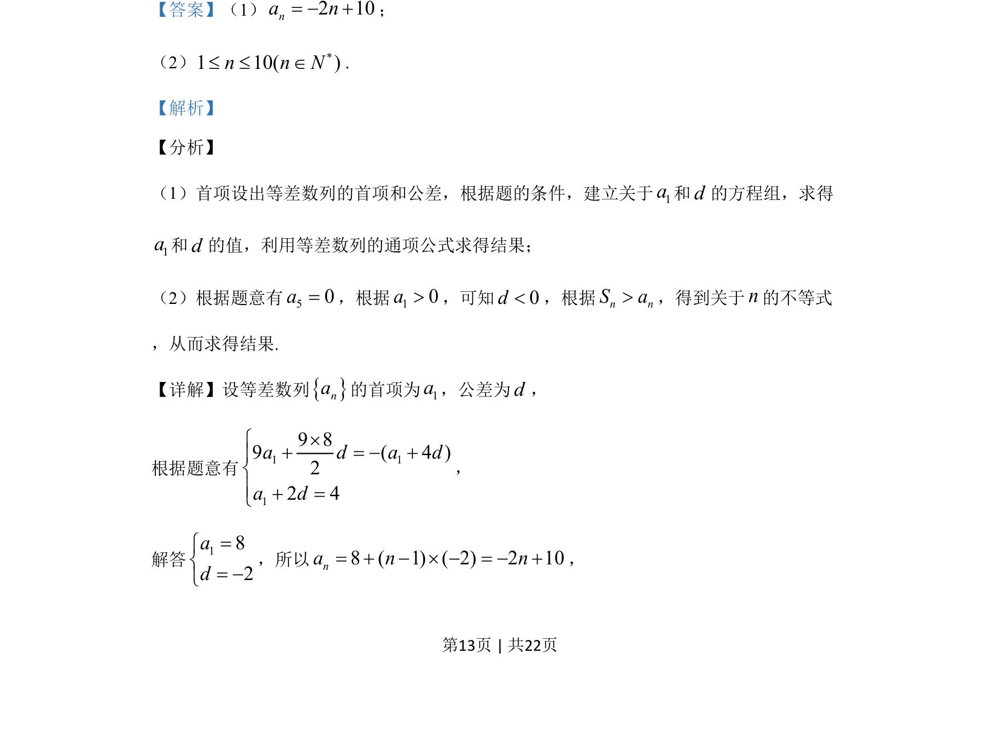
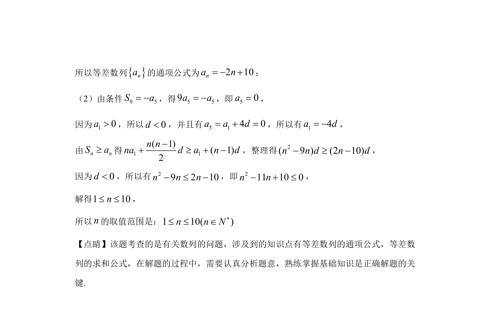

## 题面

## 摘要

等差数列通项公式求解，利用前n项和与项的关系建立不等式并解不等式

## 关联考点

- [[1063-等差数列通项公式|等差数列通项公式]]
- [[355-等差数列前n项和|等差数列前n项和]]
- [[267-一元二次不等式|一元二次不等式]]

## 答案与解析

> 📄 原 PDF 第 13 页：`素材/真题/湖南/2008-2024·（湖南）数学高考真题/2019年高考数学试卷（文）（新课标Ⅰ）（解析卷）.pdf`
