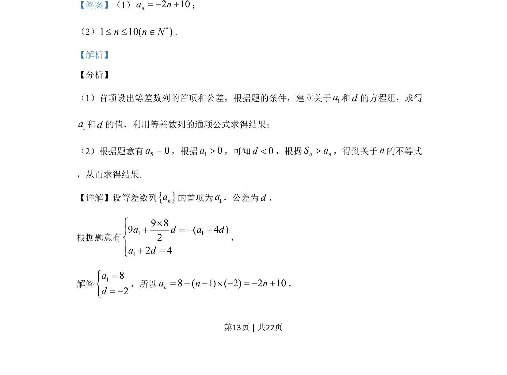
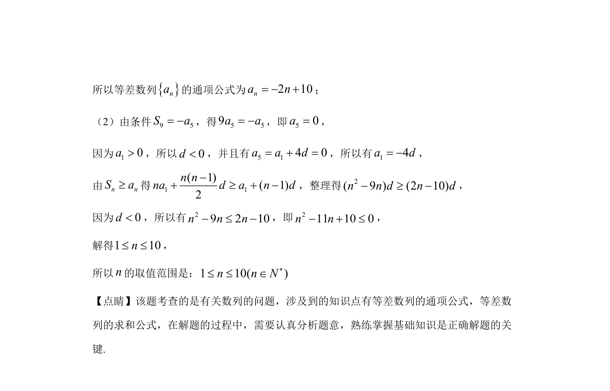

## 题面

## 摘要

等差数列通项公式求解，利用前n项和与项的关系建立不等式并解不等式

## 关联考点

- [[1063-等差数列通项公式|等差数列通项公式]]
- [[355-等差数列前n项和|等差数列前n项和]]
- [[267-一元二次不等式|一元二次不等式]]

## 答案与解析

> 📄 原 PDF 第 13 页：`素材/真题/湖南/2008-2024·（湖南）数学高考真题/2019年高考数学试卷（文）（新课标Ⅰ）（解析卷）.pdf`

<!-- 题干文本-start -->
## 题干文本
18.记Sn为等差数列{an}的前n项和，已知S9=－a5．
（1）若a3=4，求{an}的通项公式；
（2）若a1>0，求使得Sn≥an的n的取值范围．
<!-- 题干文本-end -->

<!-- 解析文本-start -->
## 解析文本
【答案】（1）2 10na n= - +；
（2）1 10( )n n N*£ £ Î.
【解析】
【分析】
（1）首项设出等差数列的首项和公差，根据题的条件，建立关于1a和d的方程组，求得
1a和d的值，利用等差数列的通项公式求得结果；
（2）根据题意有50a=，根据10a>，可知0d<，根据n nS a>，得到关于n的不等式
，从而求得结果.
【详解】设等差数列{}na的首项为1a，公差为d，
根据题意有1 119 89 ( 4 )22 4a d a da d´ì+ = - +ïíï+ =î
，
解答182ad=ìí= -î
，所以8 ( 1) ( 2) 2 10na n n= + - ´ - = - +，
<!-- 解析文本-end -->
