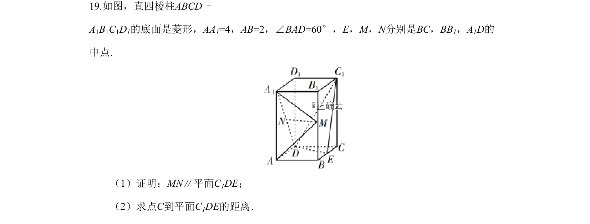
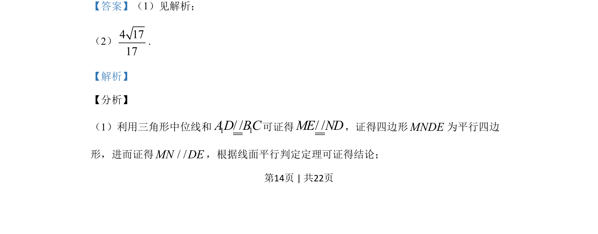
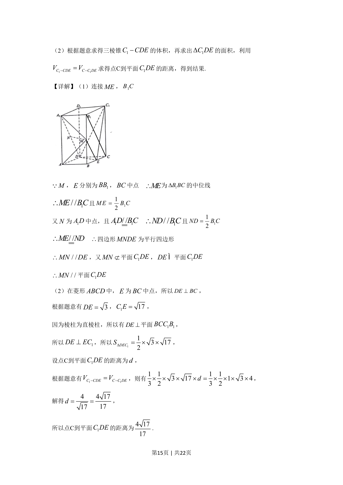
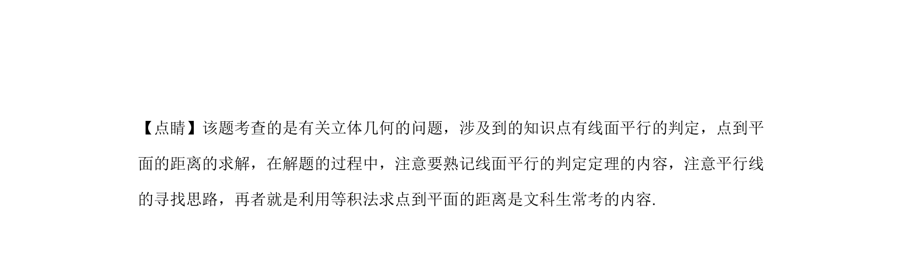

## 题面

## 摘要

本题考查线面平行判定、点到平面距离的等积法，以及导数零点存在性与恒成立求参数范围。

## 关联考点

- [[1088-线面平行判定|线面平行判定]]
- [[978-点到平面距离|点到平面距离]]
- [[1057-等体积法|等体积法]]
- [[446-导数零点存在性|导数零点存在性]]
- [[恒成立求参]]

## 答案与解析

> 📄 原 PDF 第 14 页：`素材/真题/湖南/2008-2024·（湖南）数学高考真题/2019年高考数学试卷（文）（新课标Ⅰ）（解析卷）.pdf`
