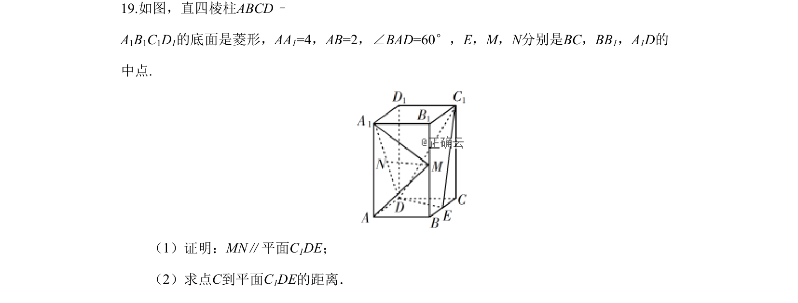
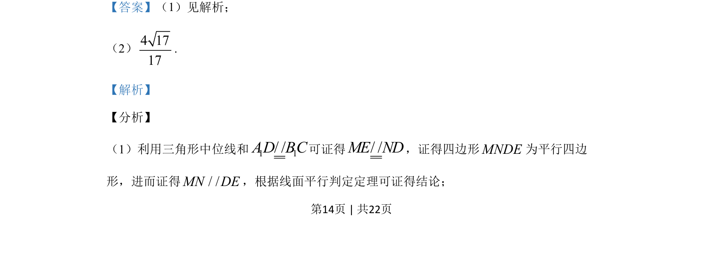
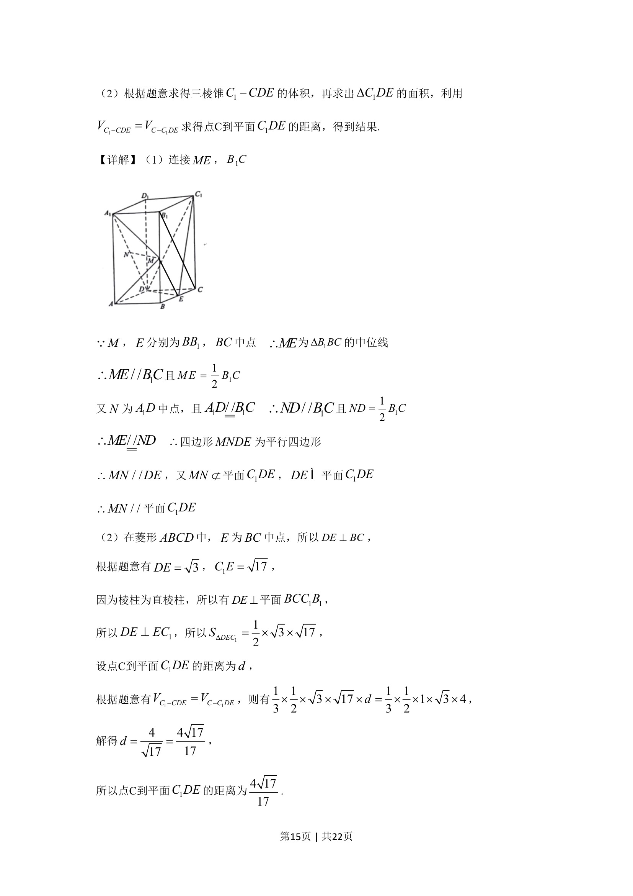
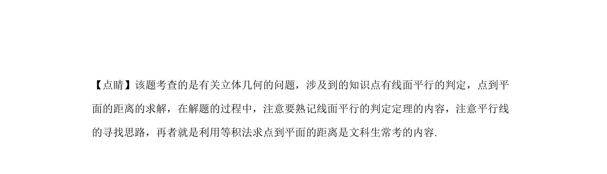

## 题面

## 摘要

本题考查线面平行判定、点到平面距离的等积法，以及导数零点存在性与恒成立求参数范围。

## 关联考点

- [[1400-线面平行的判定|线面平行判定]]
- [[977-点到平面的距离|点到平面距离]]
- [[1057-等体积法|等体积法]]
- [[446-导数零点存在性|导数零点存在性]]
- [[恒成立求参]]

## 答案与解析

> 📄 原 PDF 第 14 页：`素材/真题/湖南/2008-2024·（湖南）数学高考真题/2019年高考数学试卷（文）（新课标Ⅰ）（解析卷）.pdf`

<!-- 题干文本-start -->
## 题干文本
19.如图，直四棱柱ABCD–
A1B1C1D1的底面是菱形，AA1=4，AB=2，∠BAD=60°，E，M，N分别是BC，BB1，A1D的
中点.
（1）证明：MN∥平面C1DE；
（2）求点C到平面C1DE的距离．
<!-- 题干文本-end -->

<!-- 解析文本-start -->
## 解析文本
【答案】（1）见解析；
（2）4 1717
.
【解析】
【分析】
（1）利用三角形中位线和1 1/ /AD BC可证得/ /ME ND，证得四边形MNDE为平行四边
形，进而证得/ /MN DE，根据线面平行判定定理可证得结论；
<!-- 解析文本-end -->
