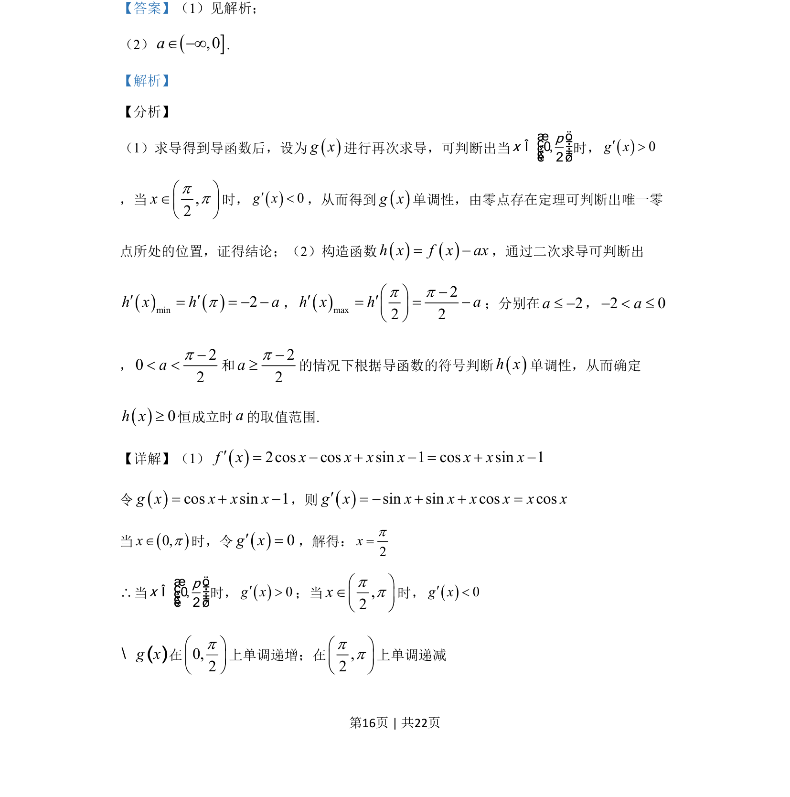
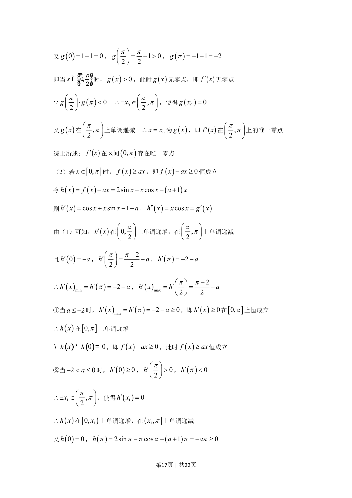
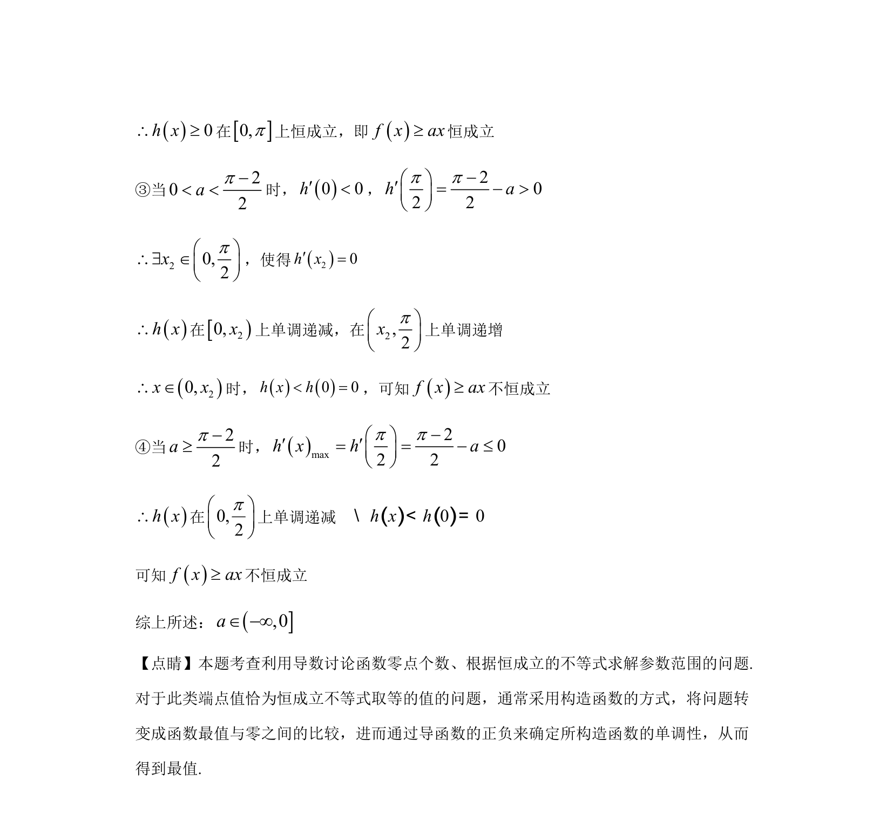

## 题面

## 摘要

考查导数与函数单调性、零点及不等式恒成立问题的综合应用

## 关联考点

- [[导数及其应用]]
- [[694-函数零点存在性定理|函数零点存在性定理]]
- [[1182-分类讨论思想|分类讨论思想]]

## 答案与解析

> 📄 原 PDF 第 16 页：`素材/真题/湖南/2008-2024·（湖南）数学高考真题/2019年高考数学试卷（文）（新课标Ⅰ）（解析卷）.pdf`
