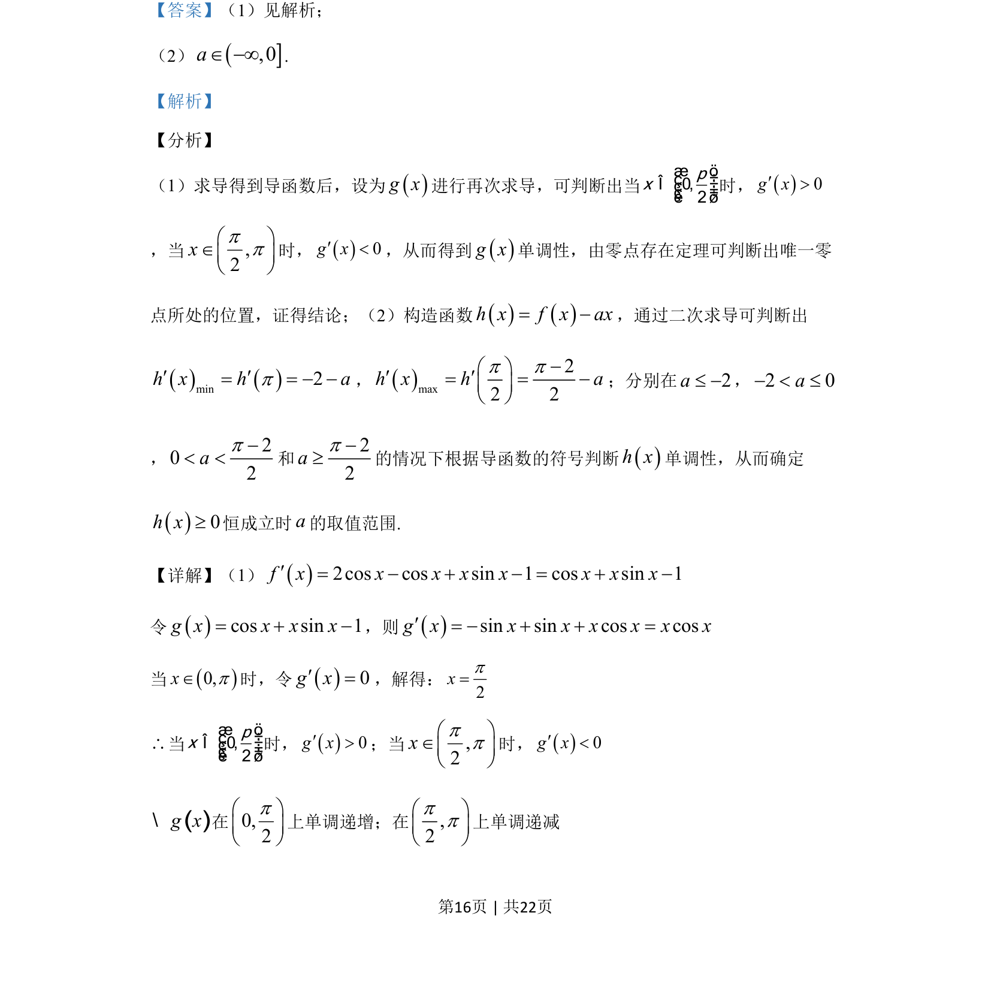
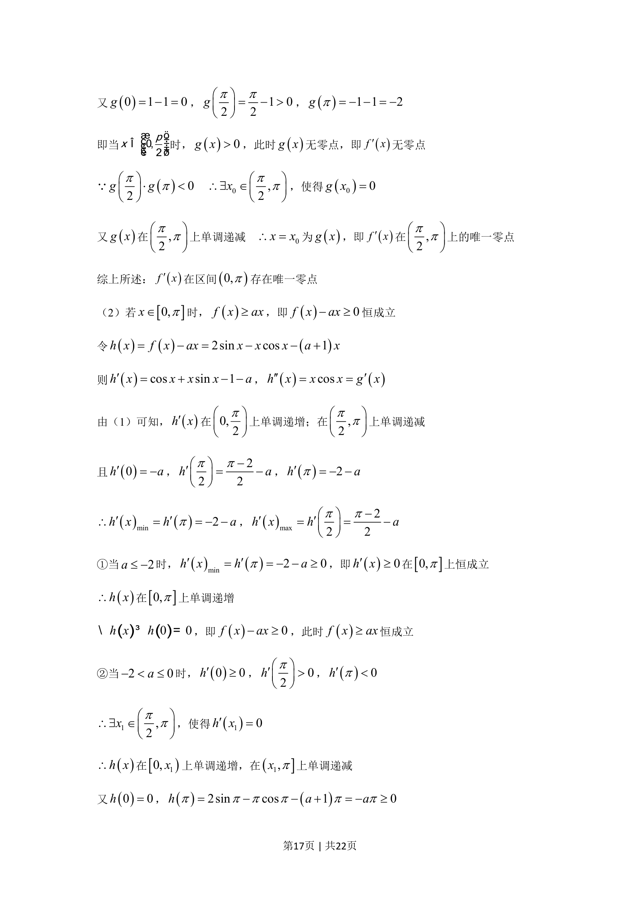
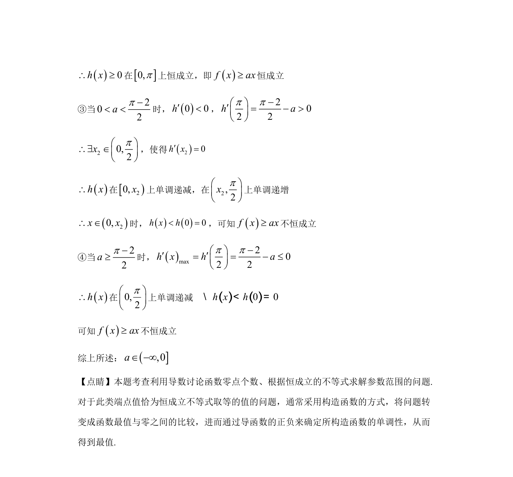

## 题面

## 摘要

考查导数与函数单调性、零点及不等式恒成立问题的综合应用

## 关联考点

- [[导数及其应用]]
- [[694-函数零点存在性定理|函数零点存在性定理]]
- [[1182-分类讨论思想|分类讨论思想]]

## 答案与解析

> 📄 原 PDF 第 16 页：`素材/真题/湖南/2008-2024·（湖南）数学高考真题/2019年高考数学试卷（文）（新课标Ⅰ）（解析卷）.pdf`

<!-- 题干文本-start -->
## 题干文本
20.已知函数f（x）=2sinx－xcosx－x，f′（x）为f（x）的导数．
（1）证明：f′（x）在区间（0，π）存在唯一零点；
（2）若x∈[0，π]时，f（x）≥ax，求a的取值范围．
<!-- 题干文本-end -->

<!-- 解析文本-start -->
## 解析文本
【答案】（1）见解析；
（2）(],0aÎ -¥.
【解析】
【分析】
（1）求导得到导函数后，设为()g x进行再次求导，可判断出当0 ,2xpæ ö÷çÎ ÷ç÷ç÷è ø时，()0g x¢>
，当,2xππæ öÎç ÷è ø
时，()0g x¢<，从而得到()g x单调性，由零点存在定理可判断出唯一零
点所处的位置，证得结论；（2）构造函数()()h x f x ax= -，通过二次求导可判断出
()()min2h x h aπ¢ ¢= = - -，()max22 2h x h aπ π-æ ö¢ ¢= = -ç ÷è ø
；分别在2a£ -，2 0a- < £
， 202aπ-< <和22aπ-³的情况下根据导函数的符号判断()h x单调性，从而确定
()0h x³恒成立时a的取值范围.
【详解】（1）()2cos cos sin 1 cos sin 1f x x x x x x x x¢= - + - = + -
令()cos sin 1g x x x x= + -，则()sin sin cos cosg x x x x x x x¢= - + + =
当()0,xπÎ时，令()0g x¢=，解得：2xπ=\当0 ,2xpæ ö÷çÎ ÷ç÷ç÷è ø时，()0g x¢>；当,2xππæ öÎç ÷è ø
时，()0g x¢<()g x\在0,2πæ öç ÷è ø
上单调递增；在,2ππæ öç ÷è ø
上单调递减
<!-- 解析文本-end -->
