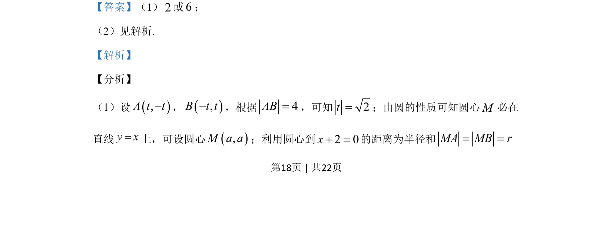
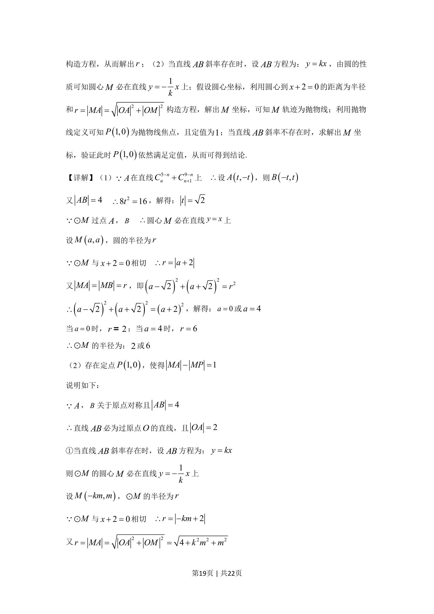
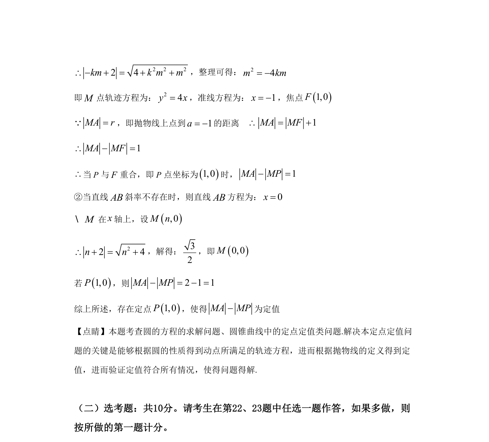

## 题面

## 摘要

本题考查圆的性质、直线与圆位置关系及轨迹方程的求解，涉及抛物线定义的应用。

## 关联考点

- [[782-圆的方程|圆的方程]]
- [[980-点到直线的距离|点到直线的距离]]
- [[376-圆锥曲线轨迹问题|轨迹方程]]
- [[227-抛物线|抛物线定义]]

## 答案与解析

> 📄 原 PDF 第 18 页：`素材/真题/湖南/2008-2024·（湖南）数学高考真题/2019年高考数学试卷（文）（新课标Ⅰ）（解析卷）.pdf`
