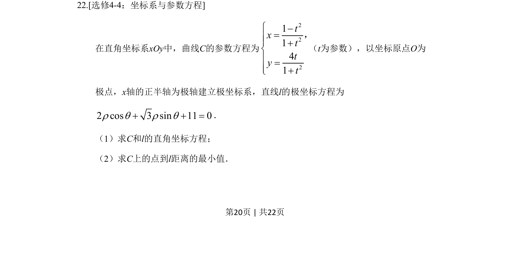
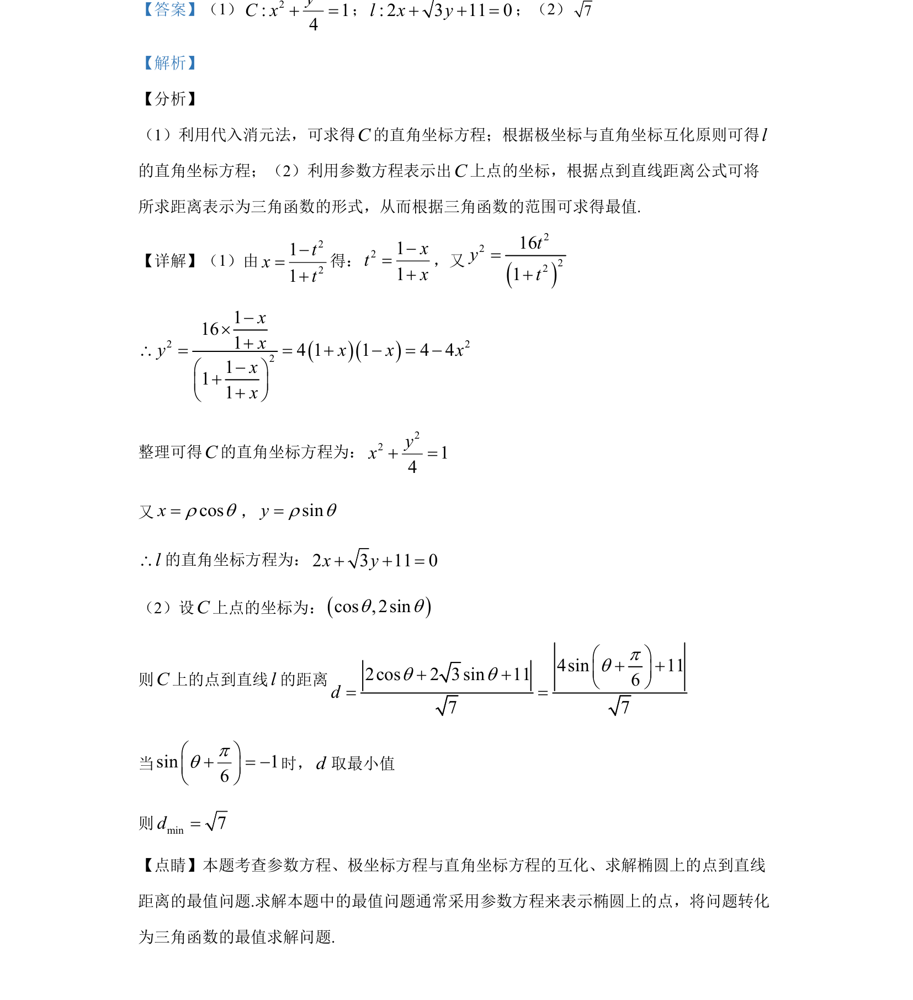

## 题面

## 摘要

参数方程与极坐标方程化为直角坐标方程，并用参数法求椭圆上点到直线距离的最值

## 关联考点

- [[参数方程与直角坐标互化]]
- [[920-极坐标与直角坐标互化|极坐标与直角坐标互化]]
- [[1211-点到直线距离|点到直线距离]]
- [[607-三角函数最值|三角函数最值]]

## 答案与解析

> 📄 原 PDF 第 20 页：`素材/真题/湖南/2008-2024·（湖南）数学高考真题/2019年高考数学试卷（文）（新课标Ⅰ）（解析卷）.pdf`
