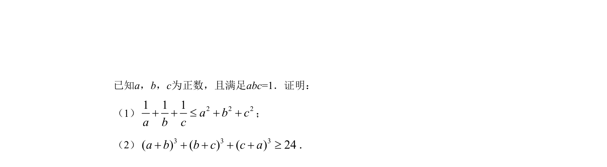
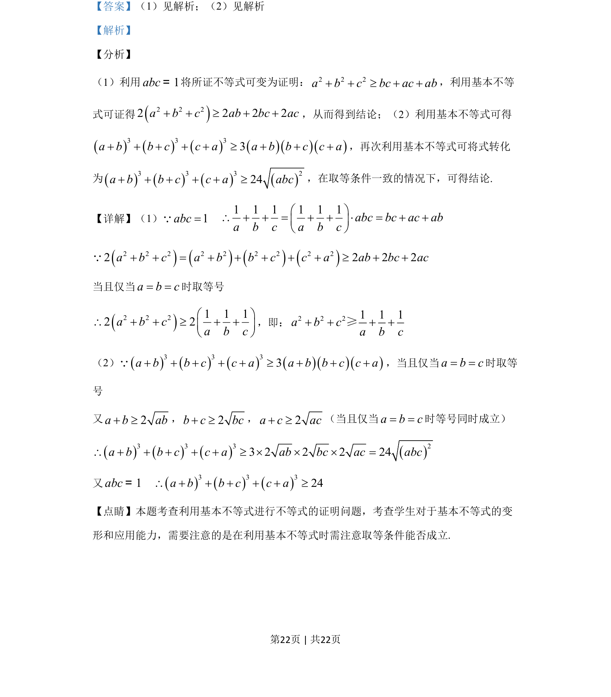

## 题面

## 摘要

利用基本不等式证明含条件abc=1的不等式，考查变形与取等条件的应用。

## 关联考点

- [[295-基本不等式|基本不等式]]
- [[625-不等式证明|不等式证明]]
- [[等号成立条件]]

## 答案与解析

> 📄 原 PDF 第 21 页：`素材/真题/湖南/2008-2024·（湖南）数学高考真题/2019年高考数学试卷（文）（新课标Ⅰ）（解析卷）.pdf`
