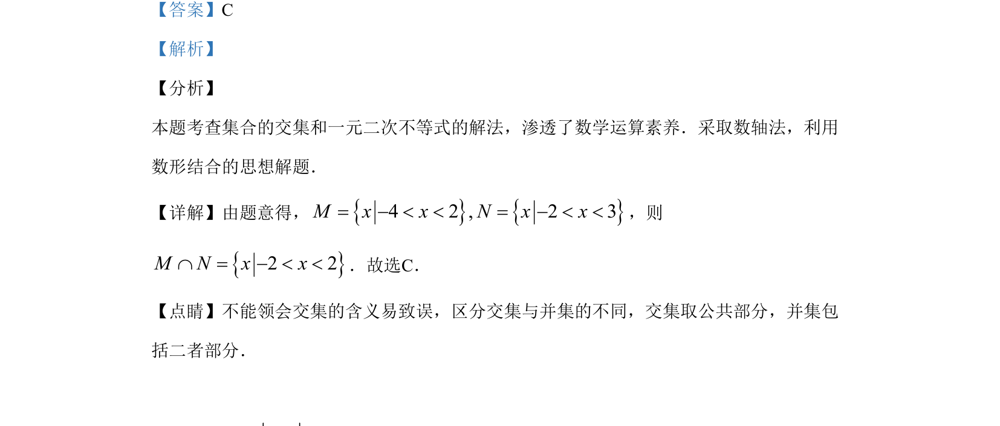

## 题面

## 摘要

本题考查集合的交集运算和一元二次不等式的解法，渗透数形结合思想。

## 关联考点

- [[1139-集合的交集|集合的交集]]
- [[597-一元二次不等式解法|一元二次不等式解法]]

## 答案与解析

> 📄 原 PDF 第 1 页：`素材/真题/湖南/2008-2024·（湖南）数学高考真题/2019年高考数学试卷（理）（新课标Ⅰ）（解析卷）.pdf`

<!-- 题干文本-start -->
## 题干文本
1.已知集合{}}24 2 { 6 0M x x N x x x= - < < = - - <，，则M NÇ=
A. }{ 4 3x x- < <B. }{ 4 2x x- < < -C. }{ 2 2x x- < <D. 
}{ 2 3x x< <
<!-- 题干文本-end -->

<!-- 解析文本-start -->
## 解析文本
【答案】C
【解析】
【分析】
本题考查集合的交集和一元二次不等式的解法，渗透了数学运算素养．采取数轴法，利用
数形结合的思想解题．
【详解】由题意得，{}{}4 2 , 2 3M x x N x x= - < < = - < <，则
{}2 2M N x xÇ = - < <．故选C．
【点睛】不能领会交集的含义易致误，区分交集与并集的不同，交集取公共部分，并集包
括二者部分．
<!-- 解析文本-end -->
