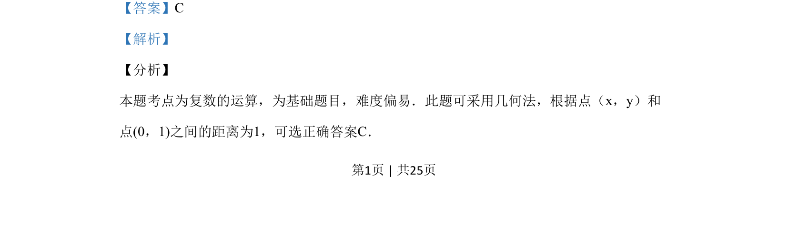
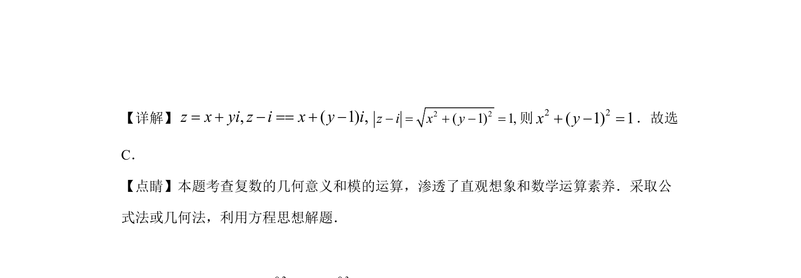

## 题面

## 摘要

本题考查复数的模及其几何意义，通过模长条件判断点的轨迹或选项。

## 关联考点

- [[803-复数模长|复数的模]]
- [[333-复数的几何意义|复数的几何意义]]
- [[1183-直观想象|直观想象]]
- [[906-方程思想|方程思想]]

## 答案与解析

> 📄 原 PDF 第 1 页：`素材/真题/湖南/2008-2024·（湖南）数学高考真题/2019年高考数学试卷（理）（新课标Ⅰ）（解析卷）.pdf`
