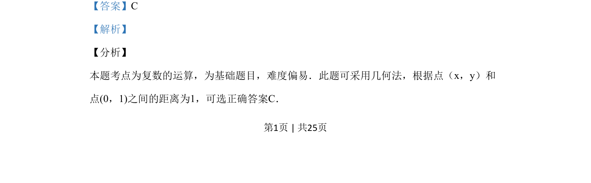
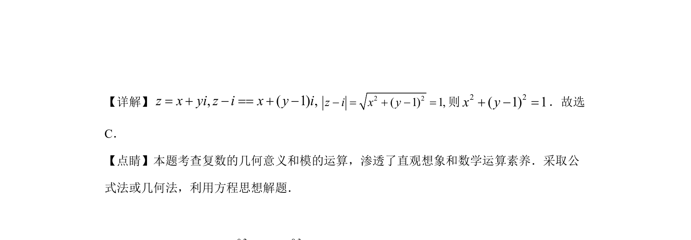

## 题面

## 摘要

本题考查复数的模及其几何意义，通过模长条件判断点的轨迹或选项。

## 关联考点

- [[803-复数模长|复数的模]]
- [[333-复数的几何意义|复数的几何意义]]
- [[1183-直观想象|直观想象]]
- [[906-方程思想|方程思想]]

## 答案与解析

> 📄 原 PDF 第 1 页：`素材/真题/湖南/2008-2024·（湖南）数学高考真题/2019年高考数学试卷（理）（新课标Ⅰ）（解析卷）.pdf`

<!-- 题干文本-start -->
## 题干文本
2.设复数z满足=1iz-，z在复平面内对应的点为(x，y)，则
A. 22+1 1( )x y+ =B. 2 2( 1) 1x y- + =C. 2 2( 1) 1x y+ - =D. 
22( +1) 1yx+ =
<!-- 题干文本-end -->

<!-- 解析文本-start -->
## 解析文本
【答案】C
【解析】
【分析】
本题考点为复数的运算，为基础题目，难度偏易．此题可采用几何法，根据点（x，y）和
点(0，1)之间的距离为1，可选正确答案C．
<!-- 解析文本-end -->
