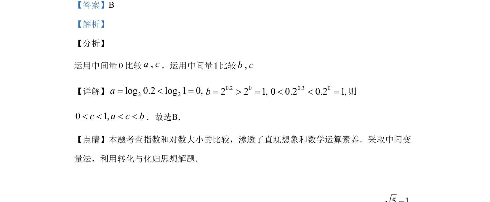

## 题面

## 摘要

运用中间量0、1比较指数与对数的大小，考查数值大小比较方法。

## 关联考点

- [[298-对数函数|对数函数性质]]
- [[306-指数函数的性质|指数函数性质]]
- [[数值比较大小]]
- [[中间量法]]

## 答案与解析

> 📄 原 PDF 第 2 页：`素材/真题/湖南/2008-2024·（湖南）数学高考真题/2019年高考数学试卷（理）（新课标Ⅰ）（解析卷）.pdf`

<!-- 题干文本-start -->
## 题干文本
3.已知 0.2 0.32log 0.2, 2 , 0.2a b c= = =，则
A. a b c< <B. a c b< <C. c a b< <D. 
b c a< <
<!-- 题干文本-end -->

<!-- 解析文本-start -->
## 解析文本
【答案】B
【解析】
【分析】
运用中间量0比较,a c，运用中间量1比较,b c
【详解】 22log0.2log10,a=<=0.20221,b==0.3000.20.21,<<=则
01,cacb<<<<．故选B．
【点睛】本题考查指数和对数大小的比较，渗透了直观想象和数学运算素养．采取中间变
量法，利用转化与化归思想解题．
<!-- 解析文本-end -->
