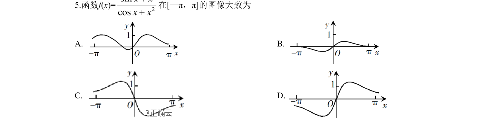
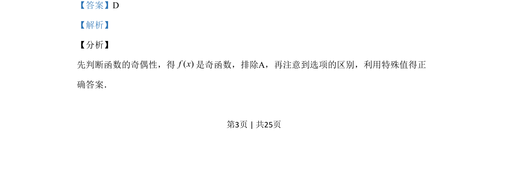
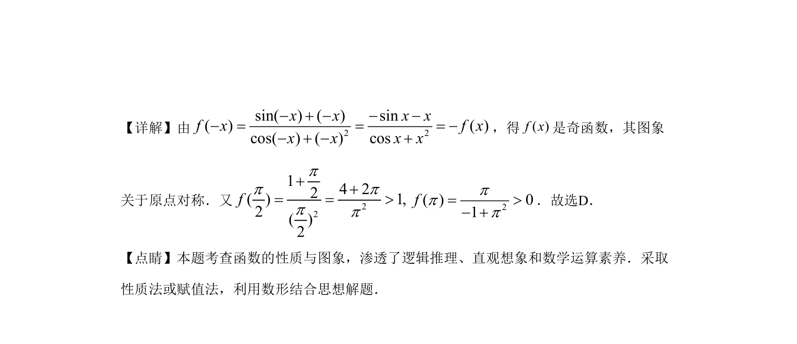

## 题面

## 摘要

考查函数图像的识别，利用奇偶性与特殊值法排除选项并求解。

## 关联考点

- [[284-函数的奇偶性|函数的奇偶性]]
- [[函数图像的识别]]
- [[1116-赋值|特殊值法]]

## 答案与解析

> 📄 原 PDF 第 3 页：`素材/真题/湖南/2008-2024·（湖南）数学高考真题/2019年高考数学试卷（理）（新课标Ⅰ）（解析卷）.pdf`

<!-- 题干文本-start -->
## 题干文本
5.函数f(x)= 2sincosx xx x++
在[—π，π]的图像大致为
A. B. 
C. D.
<!-- 题干文本-end -->

<!-- 解析文本-start -->
## 解析文本
【答案】D
【解析】
【分析】
先判断函数的奇偶性，得( )f x是奇函数，排除A，再注意到选项的区别，利用特殊值得正
确答案．
<!-- 解析文本-end -->
