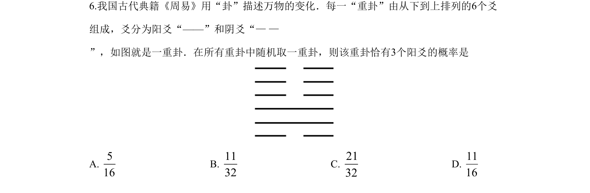
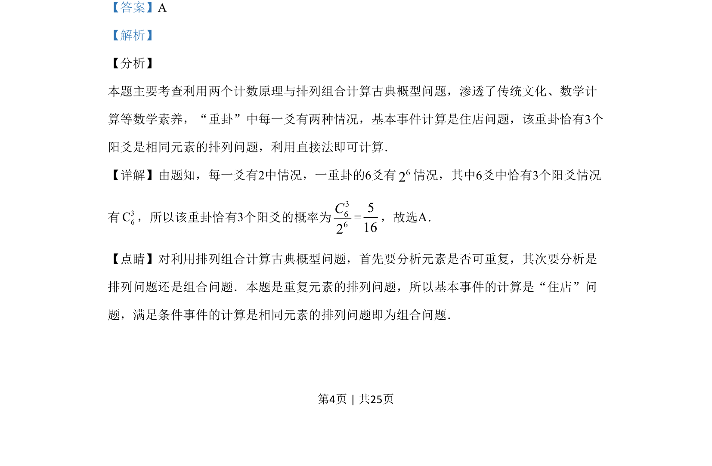

## 题面

## 摘要

本题以“重卦”为背景，考查古典概型与排列组合概率计算。

## 关联考点

- [[320-古典概型|古典概型]]
- [[031-搭配|排列组合]]
- [[1112-计数原理|计数原理]]

## 答案与解析

> 📄 原 PDF 第 4 页：`素材/真题/湖南/2008-2024·（湖南）数学高考真题/2019年高考数学试卷（理）（新课标Ⅰ）（解析卷）.pdf`

<!-- 题干文本-start -->
## 题干文本
6.我国古代典籍《周易》用“卦”描述万物的变化．每一“重卦”由从下到上排列的6个爻
组成，爻分为阳爻“——”和阴爻“— —
”，如图就是一重卦．在所有重卦中随机取一重卦，则该重卦恰有3个阳爻的概率是
A. 516
B. 1132
C. 2132
D. 1116
<!-- 题干文本-end -->

<!-- 解析文本-start -->
## 解析文本
【答案】A
【解析】
【分析】
本题主要考查利用两个计数原理与排列组合计算古典概型问题，渗透了传统文化、数学计
算等数学素养，“重卦”中每一爻有两种情况，基本事件计算是住店问题，该重卦恰有3个
阳爻是相同元素的排列问题，利用直接法即可计算．
【详解】由题知，每一爻有2中情况，一重卦的6爻有62情况，其中6爻中恰有3个阳爻情况
有36C，所以该重卦恰有3个阳爻的概率为
3662C=516
，故选A．
【点睛】对利用排列组合计算古典概型问题，首先要分析元素是否可重复，其次要分析是
排列问题还是组合问题．本题是重复元素的排列问题，所以基本事件的计算是“住店”问
题，满足条件事件的计算是相同元素的排列问题即为组合问题．
<!-- 解析文本-end -->
