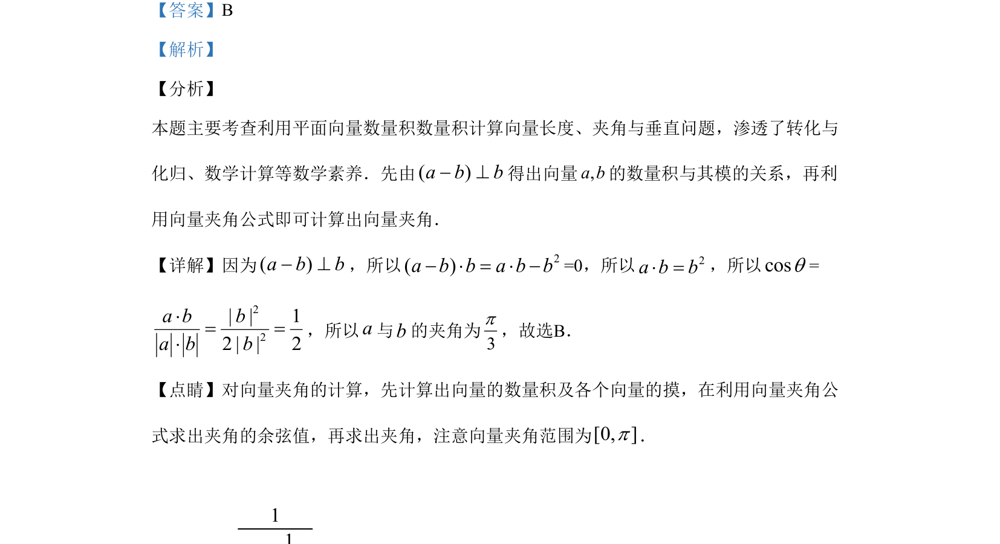

## 题面

## 摘要

利用平面向量数量积的垂直条件求向量夹角，属基础计算题。

## 关联考点

- [[854-平面向量数量积|平面向量数量积]]
- [[542-向量垂直|向量垂直]]
- [[324-向量的夹角|向量夹角]]
- [[向量模]]

## 答案与解析

> 📄 原 PDF 第 5 页：`素材/真题/湖南/2008-2024·（湖南）数学高考真题/2019年高考数学试卷（理）（新课标Ⅰ）（解析卷）.pdf`
