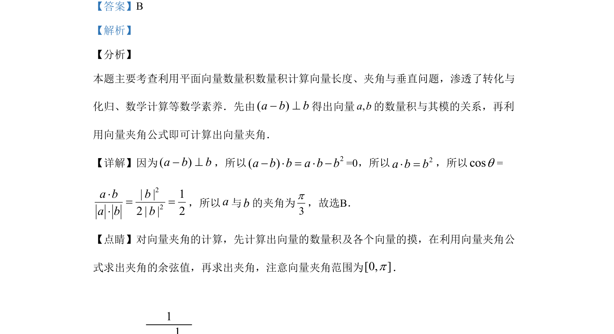

## 题面

## 摘要

利用平面向量数量积的垂直条件求向量夹角，属基础计算题。

## 关联考点

- [[854-平面向量数量积|平面向量数量积]]
- [[542-向量垂直|向量垂直]]
- [[324-向量的夹角|向量夹角]]
- [[向量模]]

## 答案与解析

> 📄 原 PDF 第 5 页：`素材/真题/湖南/2008-2024·（湖南）数学高考真题/2019年高考数学试卷（理）（新课标Ⅰ）（解析卷）.pdf`

<!-- 题干文本-start -->
## 题干文本
7.已知非零向量a，b满足a=2b，且（a–b）^b，则a与b的夹角为
A. π6B. π3C. 2π3
D. 5π6
<!-- 题干文本-end -->

<!-- 解析文本-start -->
## 解析文本
【答案】B
【解析】
【分析】
本题主要考查利用平面向量数量积数量积计算向量长度、夹角与垂直问题，渗透了转化与
化归、数学计算等数学素养．先由( )a b b- ^得出向量,a b的数量积与其模的关系，再利
用向量夹角公式即可计算出向量夹角．
【详解】因为( )a b b- ^，所以 2( )a b b a b b- × = × -=0，所以 2a b b× =，所以cosq=
22| | 12 | | 2a b ba b b×= =×，所以a与b的夹角为3π，故选B．
【点睛】对向量夹角的计算，先计算出向量的数量积及各个向量的摸，在利用向量夹角公
式求出夹角的余弦值，再求出夹角，注意向量夹角范围为[0, ]π．
<!-- 解析文本-end -->
