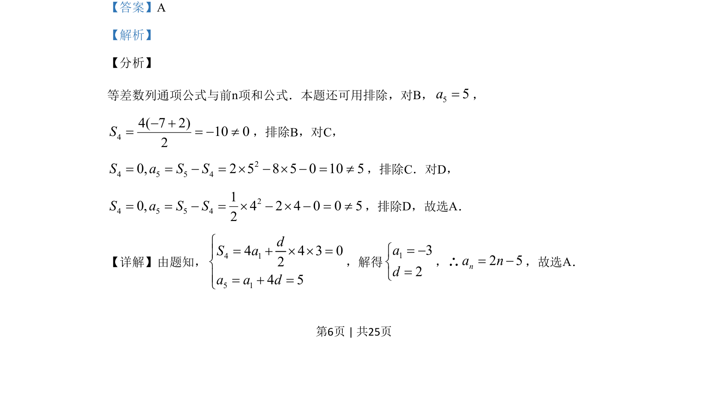
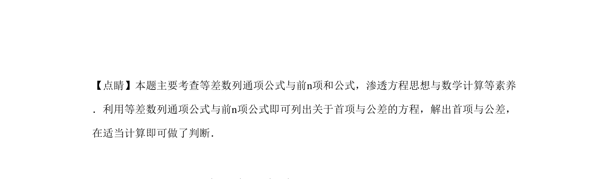

## 题面

## 摘要

等差数列通项与前n项和公式的应用，通过解方程求首项和公差，也可用排除法筛选选项。

## 关联考点

- [[1063-等差数列通项公式|等差数列通项公式]]
- [[1181-等差数列前n项和公式|等差数列前n项和公式]]
- [[906-方程思想|方程思想]]

## 答案与解析

> 📄 原 PDF 第 6 页：`素材/真题/湖南/2008-2024·（湖南）数学高考真题/2019年高考数学试卷（理）（新课标Ⅰ）（解析卷）.pdf`
