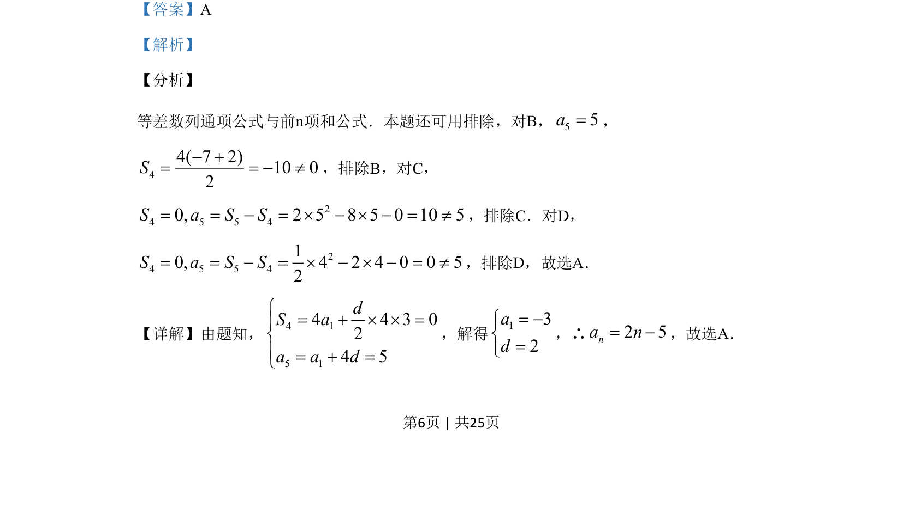
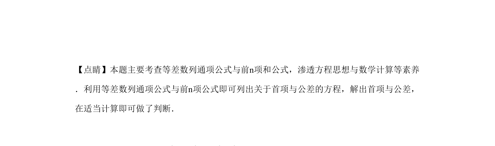

## 题面

## 摘要

等差数列通项与前n项和公式的应用，通过解方程求首项和公差，也可用排除法筛选选项。

## 关联考点

- [[1063-等差数列通项公式|等差数列通项公式]]
- [[1181-等差数列前n项和公式|等差数列前n项和公式]]
- [[906-方程思想|方程思想]]

## 答案与解析

> 📄 原 PDF 第 6 页：`素材/真题/湖南/2008-2024·（湖南）数学高考真题/2019年高考数学试卷（理）（新课标Ⅰ）（解析卷）.pdf`

<!-- 题干文本-start -->
## 题干文本
9.记nS为等差数列{ }na的前n项和．已知4 50 5S a= =，，则
A. 2 5na n= -B. 3 10na n= -C. 22 8nS n n= -D. 
2122nS n n= -
<!-- 题干文本-end -->

<!-- 解析文本-start -->
## 解析文本
【答案】A
【解析】
【分析】
等差数列通项公式与前n项和公式．本题还可用排除，对B，55a=，
44( 7 2)10 02S- += = - ¹，排除B，对C，
24 5 5 40, 2 5 8 5 0 10 5S a S S= = - = ´ - ´ - = ¹，排除C．对D，
24 5 5 410, 4 2 4 0 0 52S a S S= = - = ´ - ´ - = ¹，排除D，故选A．
【详解】由题知，4 15 14 4 3 024 5dS aa a dì= + ´ ´ =ïíï= + =î
，解得132ad= -ìí=î
，∴2 5na n= -，故选A．
<!-- 解析文本-end -->
