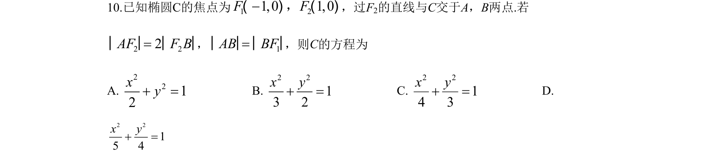
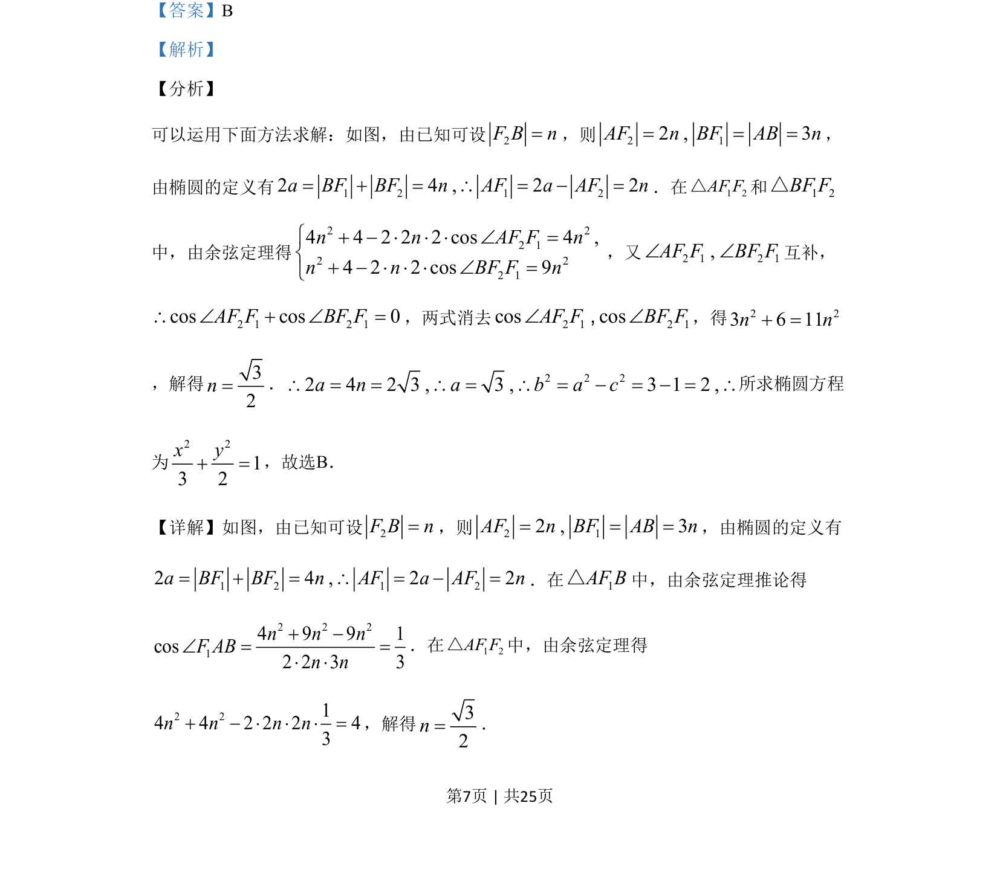
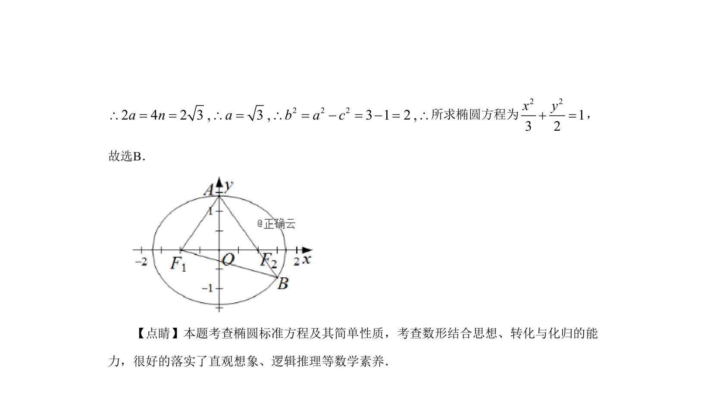

## 题面

## 摘要

通过椭圆定义与余弦定理求解椭圆标准方程，考查数形结合与转化能力。

## 关联考点

- [[1413-椭圆的定义|椭圆的定义]]
- [[126-定理|余弦定理]]
- [[061-方程|椭圆的标准方程]]
- [[898-数形结合思想|数形结合思想]]

## 答案与解析

> 📄 原 PDF 第 7 页：`素材/真题/湖南/2008-2024·（湖南）数学高考真题/2019年高考数学试卷（理）（新课标Ⅰ）（解析卷）.pdf`
