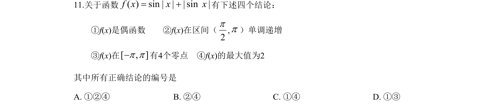
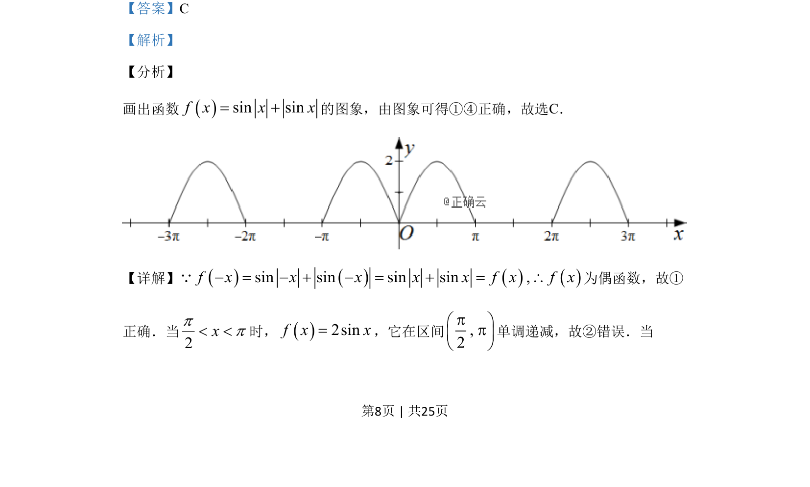
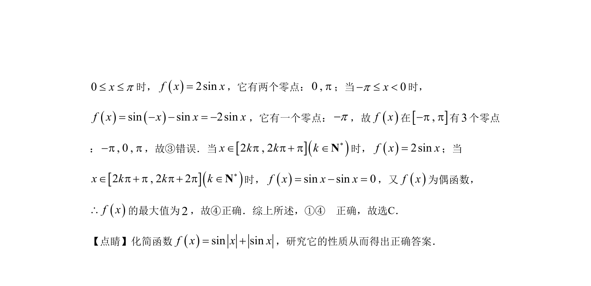

## 题面

## 摘要

该题考查含绝对值与正弦的复合函数性质，通过图象与代数推导判断奇偶性、单调区间、零点个数与最值。

## 关联考点

- [[679-函数奇偶性|函数奇偶性]]
- [[正弦函数图象]]
- [[585-绝对值函数|绝对值函数]]
- [[零点问题]]

## 答案与解析

> 📄 原 PDF 第 8 页：`素材/真题/湖南/2008-2024·（湖南）数学高考真题/2019年高考数学试卷（理）（新课标Ⅰ）（解析卷）.pdf`
