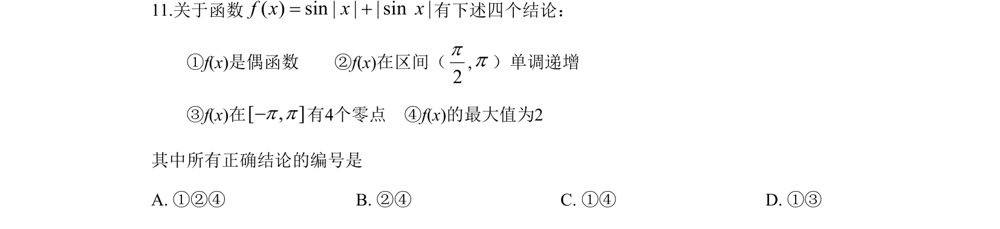
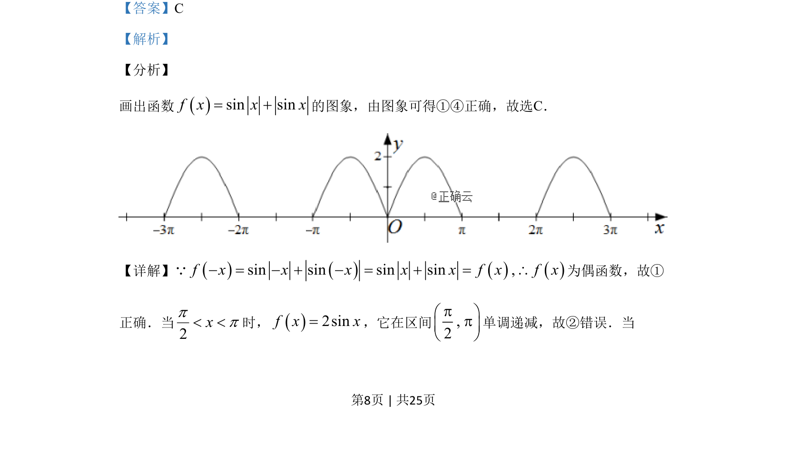
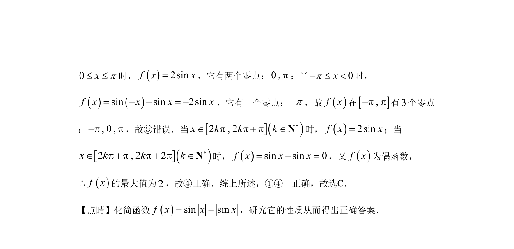

## 题面

## 摘要

该题考查含绝对值与正弦的复合函数性质，通过图象与代数推导判断奇偶性、单调区间、零点个数与最值。

## 关联考点

- [[284-函数的奇偶性|函数奇偶性]]
- [[正弦函数图象]]
- [[585-绝对值函数|绝对值函数]]
- [[零点问题]]

## 答案与解析

> 📄 原 PDF 第 8 页：`素材/真题/湖南/2008-2024·（湖南）数学高考真题/2019年高考数学试卷（理）（新课标Ⅰ）（解析卷）.pdf`

<!-- 题干文本-start -->
## 题干文本
11.关于函数( ) sin | | | sin  |f x x x= +有下述四个结论：
①f(x)是偶函数        ②f(x)在区间（
2π,π）单调递增
③f(x)在[ , ]π π-有4个零点    ④f(x)的最大值为2
其中所有正确结论的编号是
A. ①②④ B. ②④ C. ①④ D. ①③
<!-- 题干文本-end -->

<!-- 解析文本-start -->
## 解析文本
【答案】C
【解析】
【分析】
画出函数()sin sinf x x x= +的图象，由图象可得①④正确，故选C．
【详解】()()()()sin sin sin sin ,f x x x x x f x f x- = - + - = + = \Q为偶函数，故①
正确．当
2xππ< <时，()2sinf x x=，它在区间,2πæ öπç ÷è ø
单调递减，故②错误．当
<!-- 解析文本-end -->
